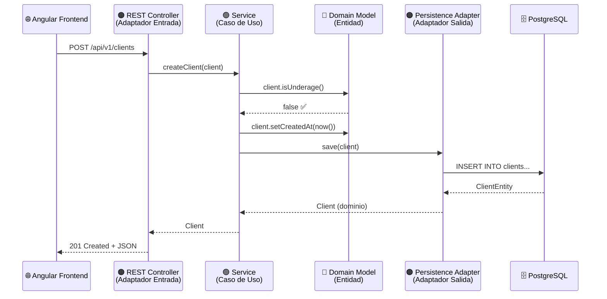

# 🏗️ Arquitectura Hexagonal (Ports & Adapters)

## 1. ¿Qué es la Arquitectura Hexagonal?

La **Arquitectura Hexagonal**, también conocida como **Ports & Adapters** (propuesta por Alistair Cockburn), es un patrón arquitectónico que busca **aislar la lógica de negocio** del mundo exterior (frameworks, bases de datos, APIs, UI).

> **Principio fundamental:** La lógica de dominio NO debe depender de ningún framework, base de datos, ni mecanismo de entrega. Todo el flujo de dependencias apunta **hacia adentro**, hacia el dominio.

```
                    ┌──────────────────────────────────────┐
                    │         INFRAESTRUCTURA               │
                    │  (Adaptadores Externos)               │
                    │                                       │
                    │  ┌──────────────────────────────────┐ │
                    │  │        APLICACIÓN                 │ │
                    │  │   (Casos de Uso / Servicios)      │ │
                    │  │                                   │ │
                    │  │  ┌──────────────────────────────┐ │ │
                    │  │  │         DOMINIO               │ │ │
                    │  │  │  (Entidades, Value Objects,   │ │ │
                    │  │  │   Reglas de Negocio,          │ │ │
                    │  │  │   Puertos/Interfaces)         │ │ │
                    │  │  └──────────────────────────────┘ │ │
                    │  │                                   │ │
                    │  └──────────────────────────────────┘ │
                    │                                       │
                    └──────────────────────────────────────┘
```

---

## 2. Capas del Proyecto

### 🔵 Capa de Dominio (`domain/`)

Es el **núcleo** de la aplicación. Contiene las **reglas de negocio puras** y no tiene dependencia de ningún framework externo.

```
domain/
├── model/                        # Entidades y Value Objects
│   ├── Client.java               # Entidad Cliente
│   ├── Account.java              # Entidad Cuenta (Producto)
│   ├── Transaction.java          # Entidad Transacción
│   ├── enums/
│   │   ├── IdentificationType.java   # Tipos de identificación
│   │   ├── AccountType.java          # SAVINGS, CHECKING
│   │   ├── AccountStatus.java        # ACTIVE, INACTIVE, CANCELLED
│   │   └── TransactionType.java      # DEPOSIT, WITHDRAWAL, TRANSFER
│   └── exception/
│       ├── ClientUnderageException.java
│       ├── ClientHasProductsException.java
│       ├── InsufficientBalanceException.java
│       ├── AccountNotFoundException.java
│       └── InvalidAccountStateException.java
├── port/
│   ├── in/                       # Puertos de Entrada (Driving Ports)
│   │   ├── ClientServicePort.java
│   │   ├── AccountServicePort.java
│   │   └── TransactionServicePort.java
│   └── out/                      # Puertos de Salida (Driven Ports)
│       ├── ClientRepositoryPort.java
│       ├── AccountRepositoryPort.java
│       └── TransactionRepositoryPort.java
```

**Responsabilidades:**
- Definir **entidades de dominio** con sus reglas de validación
- Declarar **puertos de entrada** (interfaces que exponen los casos de uso)
- Declarar **puertos de salida** (interfaces que el dominio necesita para persistencia)
- Definir **excepciones de negocio** específicas

#### Ejemplo: Entidad de Dominio `Client`

```java
package com.trinity.prueba.domain.model;

import java.time.LocalDate;
import java.time.LocalDateTime;
import java.time.Period;

public class Client {

    private Long id;
    private String identificationType;
    private String identificationNumber;
    private String firstName;
    private String lastName;
    private String email;
    private LocalDate birthDate;
    private LocalDateTime createdAt;
    private LocalDateTime updatedAt;

    // Regla de negocio: validar que sea mayor de edad
    public boolean isUnderage() {
        return Period.between(this.birthDate, LocalDate.now()).getYears() < 18;
    }

    // Regla de negocio: validar formato de email
    public boolean hasValidEmail() {
        return this.email != null &&
               this.email.matches("^[\\w.-]+@[\\w.-]+\\.[a-zA-Z]{2,}$");
    }

    // Regla de negocio: longitud mínima de nombre
    public boolean hasValidName() {
        return this.firstName != null && this.firstName.length() >= 2
            && this.lastName != null && this.lastName.length() >= 2;
    }

    // Getters, setters, constructores...
}
```

#### Ejemplo: Puerto de Entrada

```java
package com.trinity.prueba.domain.port.in;

import com.trinity.prueba.domain.model.Client;
import java.util.List;
import java.util.Optional;

public interface ClientServicePort {
    Client createClient(Client client);
    Client updateClient(Long id, Client client);
    void deleteClient(Long id);
    Optional<Client> getClientById(Long id);
    List<Client> getAllClients();
}
```

#### Ejemplo: Puerto de Salida

```java
package com.trinity.prueba.domain.port.out;

import com.trinity.prueba.domain.model.Client;
import java.util.List;
import java.util.Optional;

public interface ClientRepositoryPort {
    Client save(Client client);
    Optional<Client> findById(Long id);
    List<Client> findAll();
    void deleteById(Long id);
    boolean existsByIdentificationNumber(String identificationNumber);
}
```

---

### 🟢 Capa de Aplicación (`application/`)

Contiene los **casos de uso** (servicios de aplicación) que orquestan la lógica de negocio. Implementa los **puertos de entrada** y utiliza los **puertos de salida**.

```
application/
├── service/
│   ├── ClientService.java        # Implementa ClientServicePort
│   ├── AccountService.java       # Implementa AccountServicePort
│   └── TransactionService.java   # Implementa TransactionServicePort
├── dto/
│   ├── request/
│   │   ├── CreateClientRequest.java
│   │   ├── UpdateClientRequest.java
│   │   ├── CreateAccountRequest.java
│   │   └── CreateTransactionRequest.java
│   └── response/
│       ├── ClientResponse.java
│       ├── AccountResponse.java
│       └── TransactionResponse.java
└── mapper/
    ├── ClientMapper.java
    ├── AccountMapper.java
    └── TransactionMapper.java
```

**Responsabilidades:**
- Implementar los **casos de uso** del sistema
- **Orquestar** llamadas entre el dominio y los puertos de salida
- Realizar **validaciones de aplicación** (no de dominio)
- Gestionar **transacciones** (`@Transactional`)

#### Ejemplo: Servicio de Aplicación

```java
package com.trinity.prueba.application.service;

import com.trinity.prueba.domain.model.Client;
import com.trinity.prueba.domain.model.exception.ClientUnderageException;
import com.trinity.prueba.domain.model.exception.ClientHasProductsException;
import com.trinity.prueba.domain.port.in.ClientServicePort;
import com.trinity.prueba.domain.port.out.ClientRepositoryPort;
import com.trinity.prueba.domain.port.out.AccountRepositoryPort;
import org.springframework.transaction.annotation.Transactional;

import java.time.LocalDateTime;
import java.util.List;
import java.util.Optional;

public class ClientService implements ClientServicePort {

    private final ClientRepositoryPort clientRepository;
    private final AccountRepositoryPort accountRepository;

    public ClientService(ClientRepositoryPort clientRepository,
                         AccountRepositoryPort accountRepository) {
        this.clientRepository = clientRepository;
        this.accountRepository = accountRepository;
    }

    @Override
    @Transactional
    public Client createClient(Client client) {
        if (client.isUnderage()) {
            throw new ClientUnderageException(
                "El cliente debe ser mayor de edad");
        }
        client.setCreatedAt(LocalDateTime.now());
        return clientRepository.save(client);
    }

    @Override
    @Transactional
    public void deleteClient(Long id) {
        if (accountRepository.existsByClientId(id)) {
            throw new ClientHasProductsException(
                "No se puede eliminar: el cliente tiene productos vinculados");
        }
        clientRepository.deleteById(id);
    }

    // ... otros métodos
}
```

---

### 🟠 Capa de Infraestructura (`infraestructure/`)

Contiene los **adaptadores** que conectan el mundo exterior con el dominio. Implementa los puertos de salida y expone los de entrada.

```
infraestructure/
├── adapter/
│   ├── in/                         # Adaptadores de Entrada (Driving)
│   │   └── rest/
│   │       ├── ClientController.java
│   │       ├── AccountController.java
│   │       ├── TransactionController.java
│   │       └── handler/
│   │           └── GlobalExceptionHandler.java
│   └── out/                        # Adaptadores de Salida (Driven)
│       └── persistence/
│           ├── entity/
│           │   ├── ClientEntity.java
│           │   ├── AccountEntity.java
│           │   └── TransactionEntity.java
│           ├── repository/
│           │   ├── JpaClientRepository.java
│           │   ├── JpaAccountRepository.java
│           │   └── JpaTransactionRepository.java
│           ├── mapper/
│           │   ├── ClientPersistenceMapper.java
│           │   ├── AccountPersistenceMapper.java
│           │   └── TransactionPersistenceMapper.java
│           └── adapter/
│               ├── ClientPersistenceAdapter.java
│               ├── AccountPersistenceAdapter.java
│               └── TransactionPersistenceAdapter.java
└── config/
    ├── BeanConfiguration.java      # Inyección de dependencias
    └── CorsConfig.java             # Configuración CORS
```

**Responsabilidades:**
- Implementar **adaptadores REST** (controladores) → Adaptadores de entrada
- Implementar **adaptadores de persistencia** (JPA) → Adaptadores de salida
- **Mapear** entre entidades de dominio y entidades JPA
- Configurar **beans** e inyección de dependencias

#### Ejemplo: Adaptador REST (Entrada)

```java
package com.trinity.prueba.infraestructure.adapter.in.rest;

import com.trinity.prueba.domain.model.Client;
import com.trinity.prueba.domain.port.in.ClientServicePort;
import org.springframework.http.HttpStatus;
import org.springframework.http.ResponseEntity;
import org.springframework.web.bind.annotation.*;

import java.util.List;

@RestController
@RequestMapping("/api/v1/clients")
@CrossOrigin(origins = "http://localhost:4200")
public class ClientController {

    private final ClientServicePort clientService;

    public ClientController(ClientServicePort clientService) {
        this.clientService = clientService;
    }

    @PostMapping
    public ResponseEntity<Client> create(@RequestBody Client client) {
        return ResponseEntity.status(HttpStatus.CREATED)
                .body(clientService.createClient(client));
    }

    @GetMapping
    public ResponseEntity<List<Client>> getAll() {
        return ResponseEntity.ok(clientService.getAllClients());
    }

    @GetMapping("/{id}")
    public ResponseEntity<Client> getById(@PathVariable Long id) {
        return clientService.getClientById(id)
                .map(ResponseEntity::ok)
                .orElse(ResponseEntity.notFound().build());
    }

    @PutMapping("/{id}")
    public ResponseEntity<Client> update(@PathVariable Long id,
                                          @RequestBody Client client) {
        return ResponseEntity.ok(clientService.updateClient(id, client));
    }

    @DeleteMapping("/{id}")
    public ResponseEntity<Void> delete(@PathVariable Long id) {
        clientService.deleteClient(id);
        return ResponseEntity.noContent().build();
    }
}
```

#### Ejemplo: Adaptador de Persistencia (Salida)

```java
package com.trinity.prueba.infraestructure.adapter.out.persistence.adapter;

import com.trinity.prueba.domain.model.Client;
import com.trinity.prueba.domain.port.out.ClientRepositoryPort;
import com.trinity.prueba.infraestructure.adapter.out.persistence.entity.ClientEntity;
import com.trinity.prueba.infraestructure.adapter.out.persistence.mapper.ClientPersistenceMapper;
import com.trinity.prueba.infraestructure.adapter.out.persistence.repository.JpaClientRepository;
import org.springframework.stereotype.Component;

import java.util.List;
import java.util.Optional;

@Component
public class ClientPersistenceAdapter implements ClientRepositoryPort {

    private final JpaClientRepository jpaRepository;
    private final ClientPersistenceMapper mapper;

    public ClientPersistenceAdapter(JpaClientRepository jpaRepository,
                                     ClientPersistenceMapper mapper) {
        this.jpaRepository = jpaRepository;
        this.mapper = mapper;
    }

    @Override
    public Client save(Client client) {
        ClientEntity entity = mapper.toEntity(client);
        ClientEntity saved = jpaRepository.save(entity);
        return mapper.toDomain(saved);
    }

    @Override
    public Optional<Client> findById(Long id) {
        return jpaRepository.findById(id).map(mapper::toDomain);
    }

    @Override
    public List<Client> findAll() {
        return jpaRepository.findAll().stream()
                .map(mapper::toDomain)
                .toList();
    }

    @Override
    public void deleteById(Long id) {
        jpaRepository.deleteById(id);
    }

    @Override
    public boolean existsByIdentificationNumber(String identificationNumber) {
        return jpaRepository.existsByIdentificationNumber(identificationNumber);
    }
}
```

---

## 3. Flujo de una Petición



---

## 4. Regla de Dependencia

> **Las dependencias siempre apuntan hacia adentro.**

```
Infraestructura → Aplicación → Dominio
       ↓               ↓           ↑
  (Implementa)    (Implementa)  (Nunca depende
   puertos de      puertos de    de nada externo)
   salida          entrada
```

| Capa | Puede depender de | NO puede depender de |
|------|-------------------|---------------------|
| **Dominio** | Nada (solo Java puro) | Application, Infrastructure, Spring |
| **Aplicación** | Dominio | Infrastructure, controladores |
| **Infraestructura** | Dominio, Aplicación | — (puede depender de todo) |

---

## 5. Beneficios de esta Arquitectura

| Beneficio | Descripción |
|-----------|-------------|
| **Testabilidad** | El dominio se puede testear sin Spring, sin BD |
| **Flexibilidad** | Cambiar BD (PostgreSQL → MongoDB) sin tocar el dominio |
| **Mantenibilidad** | Reglas de negocio centralizadas y protegidas |
| **Independencia** | El framework es un detalle de implementación |
| **Escalabilidad** | Fácil agregar nuevos adaptadores (GraphQL, gRPC, etc.) |

---

## 6. Configuración de Beans

La inyección de dependencias se configura en `BeanConfiguration.java` para conectar las capas:

```java
package com.trinity.prueba.infraestructure.config;

import com.trinity.prueba.application.service.ClientService;
import com.trinity.prueba.application.service.AccountService;
import com.trinity.prueba.application.service.TransactionService;
import com.trinity.prueba.domain.port.in.ClientServicePort;
import com.trinity.prueba.domain.port.in.AccountServicePort;
import com.trinity.prueba.domain.port.in.TransactionServicePort;
import com.trinity.prueba.domain.port.out.*;
import org.springframework.context.annotation.Bean;
import org.springframework.context.annotation.Configuration;

@Configuration
public class BeanConfiguration {

    @Bean
    public ClientServicePort clientServicePort(
            ClientRepositoryPort clientRepository,
            AccountRepositoryPort accountRepository) {
        return new ClientService(clientRepository, accountRepository);
    }

    @Bean
    public AccountServicePort accountServicePort(
            AccountRepositoryPort accountRepository,
            ClientRepositoryPort clientRepository) {
        return new AccountService(accountRepository, clientRepository);
    }

    @Bean
    public TransactionServicePort transactionServicePort(
            TransactionRepositoryPort transactionRepository,
            AccountRepositoryPort accountRepository) {
        return new TransactionService(transactionRepository, accountRepository);
    }
}
```
