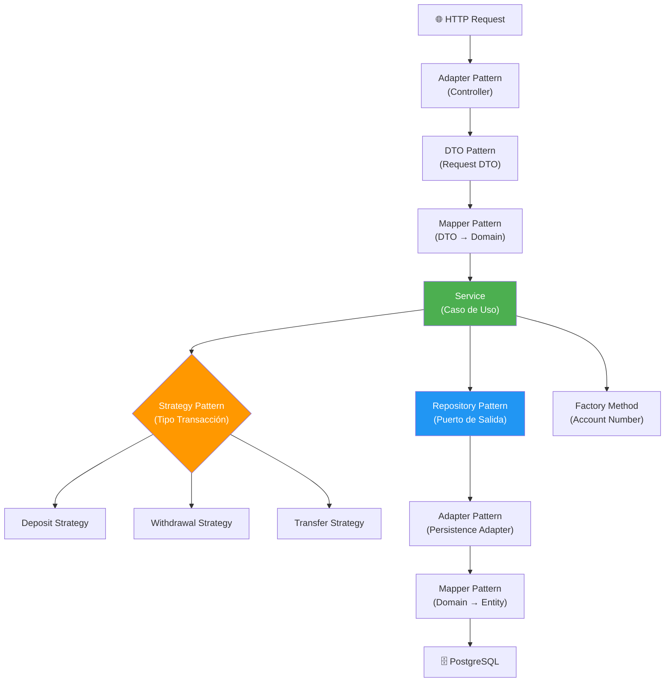

# 🧩 Patrones de Diseño Utilizados

## Visión General

Este proyecto implementa múltiples patrones de diseño que trabajan en conjunto con la arquitectura hexagonal para lograr un código **limpio**, **mantenible** y **extensible**.

---

## 1. Patrón Adapter (Adaptador)

### Descripción
El patrón **Adapter** permite que interfaces incompatibles trabajen juntas. En la arquitectura hexagonal, los adaptadores conectan el mundo exterior con el núcleo de la aplicación.

### Aplicación en el Proyecto

```
┌─────────────────┐     ┌──────────────────┐     ┌────────────────────┐
│  REST Controller │────▶│  Puerto Entrada   │────▶│   Servicio         │
│  (Adaptador IN)  │     │  (Interfaz)       │     │   (Implementación) │
└─────────────────┘     └──────────────────┘     └────────────────────┘

┌─────────────────────┐     ┌──────────────────┐     ┌──────────────────┐
│ PersistenceAdapter   │────▶│  Puerto Salida    │◀────│   Servicio       │
│ (Adaptador OUT)      │     │  (Interfaz)       │     │   (Usa interfaz) │
└─────────────────────┘     └──────────────────┘     └──────────────────┘
```

**Adaptadores de Entrada (Driving):**
- `ClientController` → Adapta peticiones HTTP al puerto `ClientServicePort`
- `AccountController` → Adapta peticiones HTTP al puerto `AccountServicePort`
- `TransactionController` → Adapta peticiones HTTP al puerto `TransactionServicePort`

**Adaptadores de Salida (Driven):**
- `ClientPersistenceAdapter` → Implementa `ClientRepositoryPort` usando JPA
- `AccountPersistenceAdapter` → Implementa `AccountRepositoryPort` usando JPA
- `TransactionPersistenceAdapter` → Implementa `TransactionRepositoryPort` usando JPA

```java
// Adaptador de salida: convierte la interfaz del dominio a JPA
@Component
public class ClientPersistenceAdapter implements ClientRepositoryPort {

    private final JpaClientRepository jpaRepository;
    private final ClientPersistenceMapper mapper;

    @Override
    public Client save(Client client) {
        ClientEntity entity = mapper.toEntity(client);     // Adapta dominio → JPA
        ClientEntity saved = jpaRepository.save(entity);
        return mapper.toDomain(saved);                     // Adapta JPA → dominio
    }
}
```

---

## 2. Patrón Repository

### Descripción
Encapsula la lógica de acceso a datos y proporciona una interfaz orientada a colecciones para acceder a los objetos del dominio.

### Aplicación en el Proyecto

Se utiliza en dos niveles:

| Nivel | Interfaz | Implementación |
|-------|----------|----------------|
| **Dominio** (Puerto) | `ClientRepositoryPort` | Define qué operaciones necesita el dominio |
| **Infraestructura** (JPA) | `JpaClientRepository` | Extiende `JpaRepository<ClientEntity, Long>` |

```java
// Puerto de salida (Dominio) - Define el contrato
public interface ClientRepositoryPort {
    Client save(Client client);
    Optional<Client> findById(Long id);
    List<Client> findAll();
    void deleteById(Long id);
    boolean existsByIdentificationNumber(String identificationNumber);
}

// Repositorio JPA (Infraestructura) - Implementación técnica
@Repository
public interface JpaClientRepository extends JpaRepository<ClientEntity, Long> {
    boolean existsByIdentificationNumber(String identificationNumber);
    List<ClientEntity> findByClientId(Long clientId);
}
```

---

## 3. Patrón DTO (Data Transfer Object)

### Descripción
Objetos que transportan datos entre capas sin contener lógica de negocio. Evitan exponer las entidades de dominio directamente.

### Aplicación en el Proyecto

```
Cliente HTTP ──▶ CreateClientRequest (DTO) ──▶ Client (Dominio) ──▶ ClientEntity (JPA)
                                               ◀──
Cliente HTTP ◀── ClientResponse (DTO) ◀──────── Client (Dominio) ◀── ClientEntity (JPA)
```

```java
// DTO de Request
public record CreateClientRequest(
    String identificationType,
    String identificationNumber,
    String firstName,
    String lastName,
    String email,
    LocalDate birthDate
) {}

// DTO de Response
public record ClientResponse(
    Long id,
    String identificationType,
    String identificationNumber,
    String firstName,
    String lastName,
    String email,
    LocalDate birthDate,
    LocalDateTime createdAt,
    LocalDateTime updatedAt
) {}
```

---

## 4. Patrón Mapper

### Descripción
Transforma objetos de una representación a otra. Se utiliza para convertir entre DTOs, entidades de dominio y entidades JPA.

### Aplicación en el Proyecto

```java
@Component
public class ClientPersistenceMapper {

    public ClientEntity toEntity(Client domain) {
        ClientEntity entity = new ClientEntity();
        entity.setId(domain.getId());
        entity.setIdentificationType(domain.getIdentificationType());
        entity.setIdentificationNumber(domain.getIdentificationNumber());
        entity.setFirstName(domain.getFirstName());
        entity.setLastName(domain.getLastName());
        entity.setEmail(domain.getEmail());
        entity.setBirthDate(domain.getBirthDate());
        entity.setCreatedAt(domain.getCreatedAt());
        entity.setUpdatedAt(domain.getUpdatedAt());
        return entity;
    }

    public Client toDomain(ClientEntity entity) {
        Client domain = new Client();
        domain.setId(entity.getId());
        domain.setIdentificationType(entity.getIdentificationType());
        domain.setIdentificationNumber(entity.getIdentificationNumber());
        domain.setFirstName(entity.getFirstName());
        domain.setLastName(entity.getLastName());
        domain.setEmail(entity.getEmail());
        domain.setBirthDate(entity.getBirthDate());
        domain.setCreatedAt(entity.getCreatedAt());
        domain.setUpdatedAt(entity.getUpdatedAt());
        return domain;
    }
}
```

---

## 5. Patrón Strategy

### Descripción
Define una familia de algoritmos, encapsula cada uno y los hace intercambiables. Se utiliza para las diferentes estrategias de transacciones.

### Aplicación en el Proyecto

```java
// Interfaz Strategy
public interface TransactionStrategy {
    void execute(Account sourceAccount, Account targetAccount, BigDecimal amount);
}

// Estrategia de Consignación
@Component
public class DepositStrategy implements TransactionStrategy {
    @Override
    public void execute(Account sourceAccount, Account targetAccount, BigDecimal amount) {
        targetAccount.credit(amount);
    }
}

// Estrategia de Retiro
@Component
public class WithdrawalStrategy implements TransactionStrategy {
    @Override
    public void execute(Account sourceAccount, Account targetAccount, BigDecimal amount) {
        sourceAccount.debit(amount);
    }
}

// Estrategia de Transferencia
@Component
public class TransferStrategy implements TransactionStrategy {
    @Override
    public void execute(Account sourceAccount, Account targetAccount, BigDecimal amount) {
        sourceAccount.debit(amount);
        targetAccount.credit(amount);
    }
}
```

---

## 6. Patrón Factory Method

### Descripción
Define una interfaz para crear objetos, pero permite que las subclases decidan qué clase instanciar.

### Aplicación en el Proyecto

Se usa para la generación automática de números de cuenta:

```java
public class AccountNumberFactory {

    private static final String SAVINGS_PREFIX = "53";
    private static final String CHECKING_PREFIX = "33";
    private static final int ACCOUNT_NUMBER_LENGTH = 10;

    public static String generate(AccountType type) {
        String prefix = switch (type) {
            case SAVINGS -> SAVINGS_PREFIX;
            case CHECKING -> CHECKING_PREFIX;
        };

        // Genera 8 dígitos aleatorios después del prefijo
        String randomDigits = String.format("%08d",
            new Random().nextInt(100_000_000));

        return prefix + randomDigits;
    }
}
```

---

## 7. Patrón Builder

### Descripción
Permite construir objetos complejos paso a paso, separando la construcción del objeto de su representación.

### Aplicación en el Proyecto

```java
public class Client {
    // ... campos

    public static class Builder {
        private Long id;
        private String identificationType;
        private String identificationNumber;
        private String firstName;
        private String lastName;
        private String email;
        private LocalDate birthDate;

        public Builder id(Long id) { this.id = id; return this; }
        public Builder identificationType(String type) { this.identificationType = type; return this; }
        public Builder identificationNumber(String number) { this.identificationNumber = number; return this; }
        public Builder firstName(String firstName) { this.firstName = firstName; return this; }
        public Builder lastName(String lastName) { this.lastName = lastName; return this; }
        public Builder email(String email) { this.email = email; return this; }
        public Builder birthDate(LocalDate date) { this.birthDate = date; return this; }

        public Client build() {
            Client client = new Client();
            client.id = this.id;
            client.identificationType = this.identificationType;
            // ... resto de asignaciones
            return client;
        }
    }
}
```

---

## 8. Patrón Singleton

### Descripción
Garantiza que una clase tenga una única instancia y proporciona un punto de acceso global a ella.

### Aplicación en el Proyecto

Spring Boot gestiona este patrón automáticamente a través del contenedor IoC. Todos los beans con scope por defecto (`@Component`, `@Service`, `@Repository`) son **Singletons**.

```java
@Component   // Spring crea UNA sola instancia
public class ClientPersistenceAdapter implements ClientRepositoryPort {
    // ... una única instancia en toda la aplicación
}
```

---

## Resumen de Patrones

| Patrón | Tipo | Ubicación en el Proyecto |
|--------|------|-------------------------|
| **Adapter** | Estructural | Controladores REST, Adaptadores de Persistencia |
| **Repository** | Datos | Puertos de salida, JPA Repositories |
| **DTO** | Datos | Request/Response en capa de aplicación |
| **Mapper** | Datos | Mappers de persistencia y aplicación |
| **Strategy** | Comportamiento | Tipos de transacciones |
| **Factory Method** | Creacional | Generación de números de cuenta |
| **Builder** | Creacional | Construcción de entidades de dominio |
| **Singleton** | Creacional | Beans de Spring (por defecto) |

---

## Diagrama de Relación de Patrones


