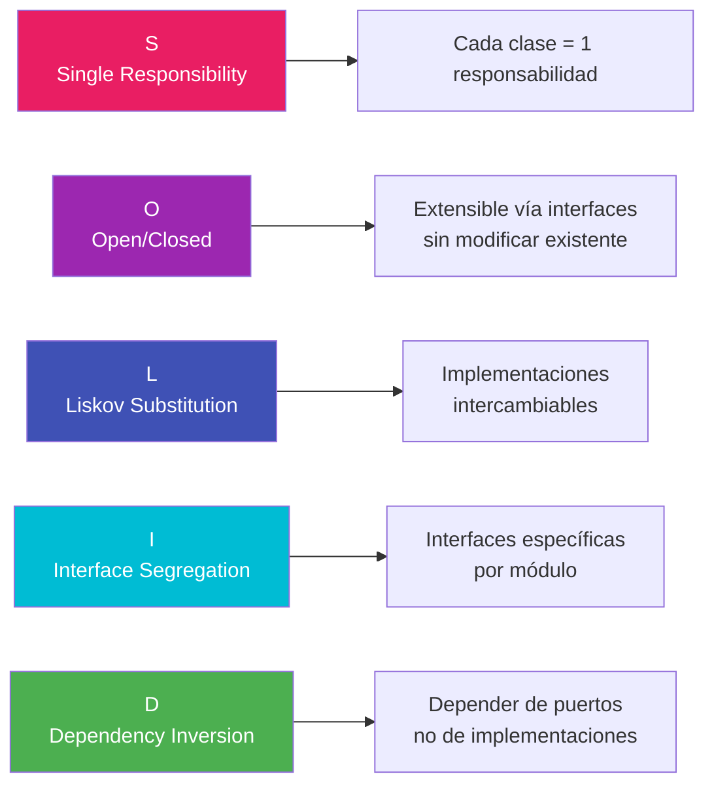

# ⚖️ Principios SOLID

## Visión General

Los principios **SOLID** son cinco principios de diseño orientado a objetos que permiten crear software **mantenible**, **escalable** y **robusto**. Este proyecto los aplica rigurosamente dentro de la arquitectura hexagonal.

---

## 1. S — Single Responsibility Principle (Principio de Responsabilidad Única)

> **"Una clase debe tener una, y solo una, razón para cambiar."**

### Aplicación en el Proyecto

Cada clase tiene **una única responsabilidad** bien definida:

| Clase | Responsabilidad Única |
|-------|----------------------|
| `Client` (Dominio) | Contener las reglas de negocio del cliente |
| `ClientService` (Aplicación) | Orquestar los casos de uso de clientes |
| `ClientController` (Infra) | Manejar peticiones HTTP de clientes |
| `ClientPersistenceAdapter` (Infra) | Persistir clientes en la base de datos |
| `ClientPersistenceMapper` (Infra) | Transformar entre entidades de dominio y JPA |
| `GlobalExceptionHandler` (Infra) | Manejar excepciones de forma centralizada |

### Ejemplo: Separación de Responsabilidades

```java
// ❌ VIOLACIÓN: Una clase hace todo
public class ClientManager {
    public Client createClient(Client client) { /* validación + persistencia + respuesta HTTP */ }
    public void sendEmail(Client client) { /* notificación */ }
    public String generateReport() { /* generación de reportes */ }
}

// ✅ CORRECTO: Cada clase con una responsabilidad
public class Client {                    // Solo reglas de negocio
    public boolean isUnderage() { ... }
}

public class ClientService {             // Solo orquestación de casos de uso
    public Client createClient(Client c) { ... }
}

public class ClientController {          // Solo manejo de HTTP
    @PostMapping
    public ResponseEntity<Client> create(@RequestBody Client c) { ... }
}
```

---

## 2. O — Open/Closed Principle (Principio Abierto/Cerrado)

> **"Las entidades de software deben estar abiertas para extensión, pero cerradas para modificación."**

### Aplicación en el Proyecto

#### Transacciones extensibles sin modificar código existente

```java
// La interfaz está CERRADA para modificación
public interface TransactionStrategy {
    void execute(Account source, Account target, BigDecimal amount);
}

// Cada tipo de transacción EXTIENDE el comportamiento
// sin modificar las clases existentes

@Component("DEPOSIT")
public class DepositStrategy implements TransactionStrategy {
    @Override
    public void execute(Account source, Account target, BigDecimal amount) {
        target.credit(amount);
    }
}

@Component("WITHDRAWAL")
public class WithdrawalStrategy implements TransactionStrategy {
    @Override
    public void execute(Account source, Account target, BigDecimal amount) {
        source.debit(amount);
    }
}

// ✅ Para agregar un nuevo tipo (ej: "PAYMENT"), solo creamos una nueva clase:
@Component("PAYMENT")
public class PaymentStrategy implements TransactionStrategy {
    @Override
    public void execute(Account source, Account target, BigDecimal amount) {
        source.debit(amount);
        // lógica adicional de pago...
    }
}
```

#### Repositorios extensibles

```java
// El puerto está CERRADO para modificación
public interface ClientRepositoryPort {
    Client save(Client client);
    Optional<Client> findById(Long id);
    // ...
}

// ✅ Se puede cambiar la implementación (JPA, MongoDB, etc.)
// sin modificar la interfaz ni el servicio que la usa
@Component
public class ClientJpaAdapter implements ClientRepositoryPort { ... }

// Potencial extensión futura:
@Component
public class ClientMongoAdapter implements ClientRepositoryPort { ... }
```

---

## 3. L — Liskov Substitution Principle (Principio de Sustitución de Liskov)

> **"Los objetos de un subtipo deben poder reemplazar a los de su tipo base sin alterar el correcto funcionamiento del programa."**

### Aplicación en el Proyecto

Cualquier implementación de un puerto puede sustituir a otra sin romper el sistema:

```java
// El servicio trabaja con la abstracción (puerto)
public class ClientService implements ClientServicePort {

    private final ClientRepositoryPort clientRepository;
    // ↑ Cualquier implementación del puerto es intercambiable

    public ClientService(ClientRepositoryPort clientRepository, ...) {
        this.clientRepository = clientRepository;
    }

    @Override
    public Client createClient(Client client) {
        // No importa si clientRepository es JPA, MongoDB, o un Mock
        // El comportamiento del servicio NO cambia
        return clientRepository.save(client);
    }
}
```

```java
// ✅ En producción:
ClientRepositoryPort repo = new ClientPersistenceAdapter(jpaRepo, mapper);
ClientService service = new ClientService(repo, accountRepo);

// ✅ En tests:
ClientRepositoryPort mockRepo = mock(ClientRepositoryPort.class);
ClientService service = new ClientService(mockRepo, mockAccountRepo);

// Ambos son intercambiables sin alterar la lógica del servicio
```

---

## 4. I — Interface Segregation Principle (Principio de Segregación de Interfaces)

> **"Los clientes no deben verse forzados a depender de interfaces que no utilizan."**

### Aplicación en el Proyecto

Las interfaces se mantienen **específicas y cohesivas**:

```java
// ❌ VIOLACIÓN: Una interfaz gigante
public interface FinancialServicePort {
    Client createClient(Client client);
    Client updateClient(Long id, Client client);
    void deleteClient(Long id);
    Account createAccount(Account account);
    Account updateAccountStatus(Long id, AccountStatus status);
    Transaction createTransaction(Transaction transaction);
    // 20 métodos más...
}

// ✅ CORRECTO: Interfaces segregadas por responsabilidad
public interface ClientServicePort {
    Client createClient(Client client);
    Client updateClient(Long id, Client client);
    void deleteClient(Long id);
    Optional<Client> getClientById(Long id);
    List<Client> getAllClients();
}

public interface AccountServicePort {
    Account createAccount(Account account);
    Account updateAccountStatus(Long id, AccountStatus status);
    void cancelAccount(Long id);
    Optional<Account> getAccountById(Long id);
    List<Account> getAccountsByClientId(Long clientId);
}

public interface TransactionServicePort {
    Transaction createTransaction(Transaction transaction);
    List<Transaction> getTransactionsByAccountId(Long accountId);
}
```

De igual forma, los puertos de salida (repositorios) están segregados:

```java
// Cada módulo tiene su propio repositorio
public interface ClientRepositoryPort { ... }
public interface AccountRepositoryPort { ... }
public interface TransactionRepositoryPort { ... }
```

---

## 5. D — Dependency Inversion Principle (Principio de Inversión de Dependencias)

> **"Los módulos de alto nivel no deben depender de módulos de bajo nivel. Ambos deben depender de abstracciones."**

### Aplicación en el Proyecto

Este principio es la **piedra angular** de la arquitectura hexagonal:

```
┌──────────────────────────────────────────────────────────────┐
│                                                              │
│   ClientService (Alto nivel)                                 │
│       ↓ depende de                                           │
│   ClientRepositoryPort (Abstracción / Interfaz)              │
│       ↑ implementa                                           │
│   ClientPersistenceAdapter (Bajo nivel)                      │
│                                                              │
│   ✅ Alto nivel → Abstracción ← Bajo nivel                   │
│   ✅ Ambos dependen de la abstracción                         │
│                                                              │
└──────────────────────────────────────────────────────────────┘
```

```java
// ✅ El servicio (alto nivel) depende de ABSTRACCIONES
public class ClientService implements ClientServicePort {

    // Depende de la interfaz, NO de la implementación
    private final ClientRepositoryPort clientRepository;
    private final AccountRepositoryPort accountRepository;

    public ClientService(
            ClientRepositoryPort clientRepository,     // Abstracción
            AccountRepositoryPort accountRepository) { // Abstracción
        this.clientRepository = clientRepository;
        this.accountRepository = accountRepository;
    }
}

// ❌ VIOLACIÓN: Depender de la implementación directamente
public class ClientService {
    private final JpaClientRepository jpaRepo;  // ← Depende de JPA directamente
}
```

### Inyección de Dependencias (IoC Container)

Spring Boot invierte el control a través de su contenedor IoC:

```java
@Configuration
public class BeanConfiguration {

    @Bean
    public ClientServicePort clientServicePort(
            ClientRepositoryPort clientRepository,     // Spring inyecta la implementación
            AccountRepositoryPort accountRepository) {
        return new ClientService(clientRepository, accountRepository);
    }
}
```

---

## Resumen de Aplicación SOLID



| Principio | Dónde se Aplica | Cómo se Evidencia |
|-----------|----------------|-------------------|
| **SRP** | Todas las capas | Clases con una sola razón de cambio |
| **OCP** | Estrategias de transacción, Repositorios | Nuevos tipos sin modificar existentes |
| **LSP** | Puertos y adaptadores | Implementaciones intercambiables |
| **ISP** | Puertos de entrada y salida | Interfaces segregadas por módulo |
| **DIP** | Servicios → Puertos ← Adaptadores | Dependencia a abstracciones |
