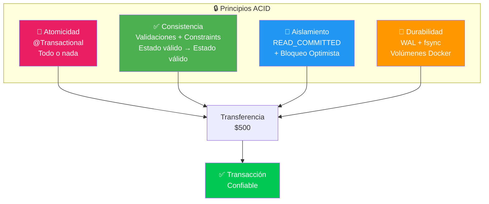

# 🔒 Principios ACID

## Visión General

Los principios **ACID** son un conjunto de propiedades que garantizan que las transacciones de base de datos se procesen de forma **confiable**. En un sistema financiero, estas garantías son **críticas** para la integridad de los datos monetarios.

---

## 1. A — Atomicity (Atomicidad)

> **"Una transacción es todo o nada. Si alguna parte falla, toda la transacción se revierte."**

### Aplicación en el Proyecto

#### Transferencias entre cuentas

Una transferencia involucra dos operaciones: **débito** en la cuenta origen y **crédito** en la cuenta destino. Ambas deben ocurrir o ninguna.

```java
@Transactional  // ← Spring garantiza atomicidad
public Transaction executeTransfer(Long sourceAccountId,
                                    Long targetAccountId,
                                    BigDecimal amount) {
    // 1. Debitar cuenta origen
    Account source = accountRepository.findById(sourceAccountId)
        .orElseThrow(() -> new AccountNotFoundException("Cuenta origen no encontrada"));
    source.debit(amount);
    accountRepository.save(source);

    // 2. Acreditar cuenta destino
    Account target = accountRepository.findById(targetAccountId)
        .orElseThrow(() -> new AccountNotFoundException("Cuenta destino no encontrada"));
    target.credit(amount);
    accountRepository.save(target);

    // 3. Registrar movimientos
    Transaction debitTx = createDebitMovement(source, amount);
    Transaction creditTx = createCreditMovement(target, amount);

    transactionRepository.save(debitTx);
    transactionRepository.save(creditTx);

    return debitTx;

    // ⚠️ Si CUALQUIER paso falla (ej: saldo insuficiente en paso 1),
    //    TODA la operación se revierte automáticamente (rollback)
}
```

#### Escenario de Rollback

```
Paso 1: Debitar $500 de Cuenta A          ✅ Éxito
Paso 2: Acreditar $500 a Cuenta B         ❌ Error (cuenta no encontrada)
Resultado: Se revierte TODO               🔄 Cuenta A recupera sus $500
```

### Configuración en Spring Boot

```java
// application.properties
spring.jpa.properties.hibernate.connection.autocommit=false

// En los servicios, @Transactional gestiona las transacciones
@Service
@Transactional(readOnly = true)  // Por defecto: solo lectura
public class TransactionService implements TransactionServicePort {

    @Transactional  // Operaciones de escritura: con commit/rollback
    public Transaction createTransaction(Transaction transaction) {
        // ...
    }
}
```

---

## 2. C — Consistency (Consistencia)

> **"Una transacción lleva la base de datos de un estado válido a otro estado válido."**

### Aplicación en el Proyecto

#### Constraints a nivel de Base de Datos

```sql
-- Constraint: saldo de cuenta de ahorros >= 0
ALTER TABLE accounts
ADD CONSTRAINT chk_savings_balance
CHECK (account_type != 'SAVINGS' OR balance >= 0);

-- Constraint: número de cuenta único
ALTER TABLE accounts
ADD CONSTRAINT uq_account_number UNIQUE (account_number);

-- Constraint: cliente vinculado a la cuenta debe existir
ALTER TABLE accounts
ADD CONSTRAINT fk_account_client
FOREIGN KEY (client_id) REFERENCES clients(id);

-- Constraint: cuenta de transacción debe existir
ALTER TABLE transactions
ADD CONSTRAINT fk_transaction_account
FOREIGN KEY (account_id) REFERENCES accounts(id);
```

#### Validaciones a nivel de Dominio

```java
public class Account {

    public void debit(BigDecimal amount) {
        if (this.accountType == AccountType.SAVINGS
            && this.balance.subtract(amount).compareTo(BigDecimal.ZERO) < 0) {
            throw new InsufficientBalanceException(
                "La cuenta de ahorros no puede tener saldo menor a $0");
        }
        this.balance = this.balance.subtract(amount);
    }

    public void cancel() {
        if (this.balance.compareTo(BigDecimal.ZERO) != 0) {
            throw new InvalidAccountStateException(
                "Solo se pueden cancelar cuentas con saldo $0");
        }
        this.status = AccountStatus.CANCELLED;
    }
}
```

#### Reglas de consistencia implementadas

| Regla | Implementación |
|-------|---------------|
| Cliente debe ser mayor de edad | Validación en `Client.isUnderage()` |
| Cuenta ahorro saldo ≥ $0 | Validación en `Account.debit()` + CHECK constraint |
| Cuenta solo cancela con saldo $0 | Validación en `Account.cancel()` |
| Número de cuenta único | UNIQUE constraint en BD |
| Cliente no se elimina con productos | Validación en `ClientService.deleteClient()` |
| Transferencia solo entre cuentas existentes | Validación en `TransactionService` |

---

## 3. I — Isolation (Aislamiento)

> **"Las transacciones concurrentes se ejecutan como si fueran secuenciales. Una no afecta a la otra."**

### Aplicación en el Proyecto

#### Nivel de Aislamiento configurado

```yaml
# application.yml
spring:
  jpa:
    properties:
      hibernate:
        connection:
          isolation: 2  # READ_COMMITTED (por defecto en PostgreSQL)
```

#### Niveles de Aislamiento Disponibles en PostgreSQL

| Nivel | Descripción | Uso en el Proyecto |
|-------|-------------|-------------------|
| **READ UNCOMMITTED** | Lee datos no confirmados | ❌ No se usa |
| **READ COMMITTED** | Lee solo datos confirmados | ✅ **Por defecto** |
| **REPEATABLE READ** | Garantiza lecturas repetibles | ⚡ Para reportes |
| **SERIALIZABLE** | Máximo aislamiento | 🔒 Para transferencias críticas |

#### Manejo de Concurrencia con Bloqueo Optimista

```java
// Entidad JPA con versión para bloqueo optimista
@Entity
@Table(name = "accounts")
public class AccountEntity {

    @Id
    @GeneratedValue(strategy = GenerationType.IDENTITY)
    private Long id;

    @Version  // ← Bloqueo optimista
    private Long version;

    @Column(nullable = false)
    private BigDecimal balance;

    // Si dos transacciones intentan modificar la misma cuenta
    // simultáneamente, una de ellas recibirá OptimisticLockException
}
```

#### Escenario de Concurrencia

```
Transacción 1: Lee Cuenta A (saldo: $1000, version: 1)
Transacción 2: Lee Cuenta A (saldo: $1000, version: 1)
Transacción 1: Retira $500 → Saldo: $500, version: 2   ✅ Commit exitoso
Transacción 2: Retira $800 → version esperada: 1, actual: 2
                                                          ❌ OptimisticLockException
                                                          🔄 Se reintenta la operación
```

---

## 4. D — Durability (Durabilidad)

> **"Una vez confirmada (commit), una transacción persiste permanentemente, incluso ante fallos del sistema."**

### Aplicación en el Proyecto

#### PostgreSQL garantiza durabilidad mediante:

1. **WAL (Write-Ahead Logging):** Todas las modificaciones se escriben primero en el log de transacciones antes de aplicarse a los datos.

2. **Checkpoints periódicos:** Los datos se sincronizan del buffer en memoria al disco.

3. **fsync:** PostgreSQL confirma que los datos están escritos en disco antes de confirmar la transacción.

```sql
-- Configuración de PostgreSQL para durabilidad
-- postgresql.conf
fsync = on                    -- Fuerza escritura a disco
synchronous_commit = on       -- Espera confirmación de escritura
wal_level = replica           -- Nivel de WAL para replicación
```

#### Respaldo y Recuperación

```yaml
# Docker Compose con volúmenes persistentes
services:
  postgres:
    image: postgres:16
    volumes:
      - postgres_data:/var/lib/postgresql/data  # ← Datos persistentes
    environment:
      POSTGRES_DB: entidad_financiera
      POSTGRES_USER: admin
      POSTGRES_PASSWORD: secret

volumes:
  postgres_data:  # ← Volumen Docker persistente
```

---

## Resumen de Aplicación ACID



| Principio | Mecanismo | Garantía |
|-----------|-----------|----------|
| **Atomicidad** | `@Transactional` + rollback automático | Todo o nada |
| **Consistencia** | Validaciones de dominio + CHECK constraints | Datos siempre válidos |
| **Aislamiento** | READ_COMMITTED + `@Version` | Sin interferencia entre transacciones |
| **Durabilidad** | WAL + fsync + volúmenes Docker | Datos sobreviven a fallos |
