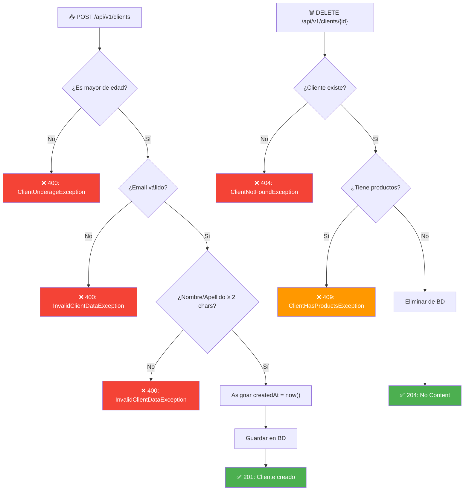

# 👤 Módulo de Clientes — Backend

## 1. Descripción Funcional

El módulo de clientes permite la **administración completa** (CRUD) de los clientes de la entidad financiera. Los clientes son el eje central del sistema, ya que los productos financieros se vinculan directamente a ellos.

---

## 2. Reglas de Negocio

| # | Regla | Tipo | Validación |
|---|-------|------|------------|
| RN-01 | Un cliente NO puede ser creado si es menor de edad | Obligatoria | `birthDate` → edad ≥ 18 años |
| RN-02 | Un cliente NO puede ser eliminado si tiene productos vinculados | Obligatoria | Verificar cuentas asociadas |
| RN-03 | La fecha de creación se calcula automáticamente | Obligatoria | `createdAt = LocalDateTime.now()` |
| RN-04 | La fecha de modificación se actualiza automáticamente | Obligatoria | `updatedAt = LocalDateTime.now()` |
| RN-05 | El email debe tener formato válido (`xxx@xxx.xxx`) | Opcional | Regex de validación |
| RN-06 | Nombre y apellido deben tener mínimo 2 caracteres | Opcional | `length >= 2` |

---

## 3. Modelo de Dominio

### Entidad `Client`

```java
package com.trinity.prueba.domain.model;

import java.time.LocalDate;
import java.time.LocalDateTime;
import java.time.Period;

public class Client {

    private Long id;
    private String identificationType;   // CC, CE, NIT, PASAPORTE
    private String identificationNumber;
    private String firstName;
    private String lastName;
    private String email;
    private LocalDate birthDate;
    private LocalDateTime createdAt;
    private LocalDateTime updatedAt;

    // ==========================================
    // REGLAS DE NEGOCIO (Domain Logic)
    // ==========================================

    /**
     * RN-01: Verifica si el cliente es menor de edad.
     * Un cliente debe tener al menos 18 años.
     */
    public boolean isUnderage() {
        if (this.birthDate == null) return true;
        return Period.between(this.birthDate, LocalDate.now()).getYears() < 18;
    }

    /**
     * RN-05: Valida el formato del correo electrónico.
     */
    public boolean hasValidEmail() {
        if (this.email == null || this.email.isBlank()) return false;
        return this.email.matches("^[\\w.-]+@[\\w.-]+\\.[a-zA-Z]{2,}$");
    }

    /**
     * RN-06: Valida la longitud mínima del nombre y apellido.
     */
    public boolean hasValidName() {
        return this.firstName != null && this.firstName.length() >= 2
            && this.lastName != null && this.lastName.length() >= 2;
    }

    // Constructores, getters, setters...
}
```

### Enumeración `IdentificationType`

```java
package com.trinity.prueba.domain.model.enums;

public enum IdentificationType {
    CC("Cédula de Ciudadanía"),
    CE("Cédula de Extranjería"),
    PASSPORT("Pasaporte");

    private final String description;

    IdentificationType(String description) {
        this.description = description;
    }

    public String getDescription() {
        return description;
    }
}
```

---

## 4. Puertos (Interfaces)

### Puerto de Entrada: `ClientServicePort`

```java
package com.trinity.prueba.domain.port.in;

import com.trinity.prueba.domain.model.Client;
import java.util.List;
import java.util.Optional;

public interface ClientServicePort {

    /**
     * Crea un nuevo cliente.
     * @throws ClientUnderageException si es menor de edad (RN-01)
     * @throws InvalidClientDataException si los datos son inválidos (RN-05, RN-06)
     */
    Client createClient(Client client);

    /**
     * Actualiza los datos de un cliente existente.
     * Calcula automáticamente la fecha de modificación (RN-04).
     */
    Client updateClient(Long id, Client client);

    /**
     * Elimina un cliente por su ID.
     * @throws ClientHasProductsException si tiene productos vinculados (RN-02)
     */
    void deleteClient(Long id);

    /** Obtiene un cliente por su ID. */
    Optional<Client> getClientById(Long id);

    /** Obtiene todos los clientes. */
    List<Client> getAllClients();
}
```

### Puerto de Salida: `ClientRepositoryPort`

```java
package com.trinity.prueba.domain.port.out;

import com.trinity.prueba.domain.model.Client;
import java.util.List;
import java.util.Optional;

public interface ClientRepositoryPort {
    Client save(Client client);
    Optional<Client> findById(Long id);
    List<Client> findAll();
    void deleteById(Long id);
    boolean existsByIdentificationNumber(String identificationNumber);
}
```

---

## 5. Caso de Uso: `ClientService`

```java
package com.trinity.prueba.application.service;

import com.trinity.prueba.domain.model.Client;
import com.trinity.prueba.domain.model.exception.*;
import com.trinity.prueba.domain.port.in.ClientServicePort;
import com.trinity.prueba.domain.port.out.ClientRepositoryPort;
import com.trinity.prueba.domain.port.out.AccountRepositoryPort;
import org.springframework.transaction.annotation.Transactional;

import java.time.LocalDateTime;
import java.util.List;
import java.util.Optional;

@Transactional(readOnly = true)
public class ClientService implements ClientServicePort {

    private final ClientRepositoryPort clientRepository;
    private final AccountRepositoryPort accountRepository;

    public ClientService(ClientRepositoryPort clientRepository,
                         AccountRepositoryPort accountRepository) {
        this.clientRepository = clientRepository;
        this.accountRepository = accountRepository;
    }

    @Override
    @Transactional
    public Client createClient(Client client) {
        // RN-01: Validar mayoría de edad
        if (client.isUnderage()) {
            throw new ClientUnderageException(
                "El cliente debe ser mayor de edad (18 años o más)");
        }

        // RN-05: Validar formato de email
        if (!client.hasValidEmail()) {
            throw new InvalidClientDataException(
                "El correo electrónico debe tener formato válido (xxx@xxx.xxx)");
        }

        // RN-06: Validar longitud de nombre/apellido
        if (!client.hasValidName()) {
            throw new InvalidClientDataException(
                "El nombre y apellido deben tener al menos 2 caracteres");
        }

        // RN-03: Fecha de creación automática
        client.setCreatedAt(LocalDateTime.now());
        client.setUpdatedAt(LocalDateTime.now());

        return clientRepository.save(client);
    }

    @Override
    @Transactional
    public Client updateClient(Long id, Client clientData) {
        Client existingClient = clientRepository.findById(id)
            .orElseThrow(() -> new ClientNotFoundException(
                "Cliente no encontrado con ID: " + id));

        // Actualizar campos
        existingClient.setIdentificationType(clientData.getIdentificationType());
        existingClient.setIdentificationNumber(clientData.getIdentificationNumber());
        existingClient.setFirstName(clientData.getFirstName());
        existingClient.setLastName(clientData.getLastName());
        existingClient.setEmail(clientData.getEmail());
        existingClient.setBirthDate(clientData.getBirthDate());

        // RN-04: Fecha de modificación automática
        existingClient.setUpdatedAt(LocalDateTime.now());

        // Validaciones de negocio
        if (existingClient.isUnderage()) {
            throw new ClientUnderageException(
                "El cliente debe ser mayor de edad");
        }

        return clientRepository.save(existingClient);
    }

    @Override
    @Transactional
    public void deleteClient(Long id) {
        // Verificar que el cliente existe
        clientRepository.findById(id)
            .orElseThrow(() -> new ClientNotFoundException(
                "Cliente no encontrado con ID: " + id));

        // RN-02: No eliminar si tiene productos vinculados
        if (accountRepository.existsByClientId(id)) {
            throw new ClientHasProductsException(
                "No se puede eliminar el cliente: tiene productos financieros vinculados");
        }

        clientRepository.deleteById(id);
    }

    @Override
    public Optional<Client> getClientById(Long id) {
        return clientRepository.findById(id);
    }

    @Override
    public List<Client> getAllClients() {
        return clientRepository.findAll();
    }
}
```

---

## 6. API REST

### Endpoints

| Método | Endpoint | Descripción | Status Code |
|--------|----------|-------------|-------------|
| `POST` | `/api/v1/clients` | Crear cliente | `201 Created` |
| `GET` | `/api/v1/clients` | Listar todos los clientes | `200 OK` |
| `GET` | `/api/v1/clients/{id}` | Obtener cliente por ID | `200 OK` / `404 Not Found` |
| `PUT` | `/api/v1/clients/{id}` | Actualizar cliente | `200 OK` |
| `DELETE` | `/api/v1/clients/{id}` | Eliminar cliente | `204 No Content` |

### Request/Response

#### `POST /api/v1/clients` — Crear Cliente

**Request Body:**
```json
{
    "identificationType": "CC",
    "identificationNumber": "1234567890",
    "firstName": "Juan",
    "lastName": "Pérez",
    "email": "juan.perez@email.com",
    "birthDate": "1990-05-15"
}
```

**Response (201 Created):**
```json
{
    "id": 1,
    "identificationType": "CC",
    "identificationNumber": "1234567890",
    "firstName": "Juan",
    "lastName": "Pérez",
    "email": "juan.perez@email.com",
    "birthDate": "1990-05-15",
    "createdAt": "2026-08-14T17:00:00",
    "updatedAt": "2026-08-14T17:00:00"
}
```

#### `PUT /api/v1/clients/{id}` — Actualizar Cliente

**Request Body:**
```json
{
    "identificationType": "CC",
    "identificationNumber": "1234567890",
    "firstName": "Juan Carlos",
    "lastName": "Pérez García",
    "email": "juancarlos@email.com",
    "birthDate": "1990-05-15"
}
```

**Response (200 OK):**
```json
{
    "id": 1,
    "identificationType": "CC",
    "identificationNumber": "1234567890",
    "firstName": "Juan Carlos",
    "lastName": "Pérez García",
    "email": "juancarlos@email.com",
    "birthDate": "1990-05-15",
    "createdAt": "2026-08-14T17:00:00",
    "updatedAt": "2026-08-14T18:30:00"
}
```

### Respuestas de Error

```json
// 400 Bad Request - Cliente menor de edad
{
    "status": 400,
    "error": "Bad Request",
    "message": "El cliente debe ser mayor de edad (18 años o más)",
    "timestamp": "2026-08-14T17:00:00"
}

// 409 Conflict - Cliente tiene productos
{
    "status": 409,
    "error": "Conflict",
    "message": "No se puede eliminar el cliente: tiene productos financieros vinculados",
    "timestamp": "2026-08-14T17:00:00"
}

// 404 Not Found - Cliente no encontrado
{
    "status": 404,
    "error": "Not Found",
    "message": "Cliente no encontrado con ID: 99",
    "timestamp": "2026-08-14T17:00:00"
}
```

---

## 7. Entidad JPA

```java
package com.trinity.prueba.infraestructure.adapter.out.persistence.entity;

import jakarta.persistence.*;
import java.time.LocalDate;
import java.time.LocalDateTime;

@Entity
@Table(name = "clients")
public class ClientEntity {

    @Id
    @GeneratedValue(strategy = GenerationType.IDENTITY)
    private Long id;

    @Column(name = "identification_type", nullable = false, length = 20)
    private String identificationType;

    @Column(name = "identification_number", nullable = false, unique = true, length = 20)
    private String identificationNumber;

    @Column(name = "first_name", nullable = false, length = 100)
    private String firstName;

    @Column(name = "last_name", nullable = false, length = 100)
    private String lastName;

    @Column(nullable = false, length = 150)
    private String email;

    @Column(name = "birth_date", nullable = false)
    private LocalDate birthDate;

    @Column(name = "created_at", nullable = false, updatable = false)
    private LocalDateTime createdAt;

    @Column(name = "updated_at", nullable = false)
    private LocalDateTime updatedAt;

    // Getters y Setters...
}
```

---

## 8. Excepciones de Negocio

```java
// Cliente menor de edad
public class ClientUnderageException extends RuntimeException {
    public ClientUnderageException(String message) {
        super(message);
    }
}

// Cliente tiene productos vinculados
public class ClientHasProductsException extends RuntimeException {
    public ClientHasProductsException(String message) {
        super(message);
    }
}

// Cliente no encontrado
public class ClientNotFoundException extends RuntimeException {
    public ClientNotFoundException(String message) {
        super(message);
    }
}

// Datos de cliente inválidos
public class InvalidClientDataException extends RuntimeException {
    public InvalidClientDataException(String message) {
        super(message);
    }
}
```

---

## 9. Diagrama de Flujo


