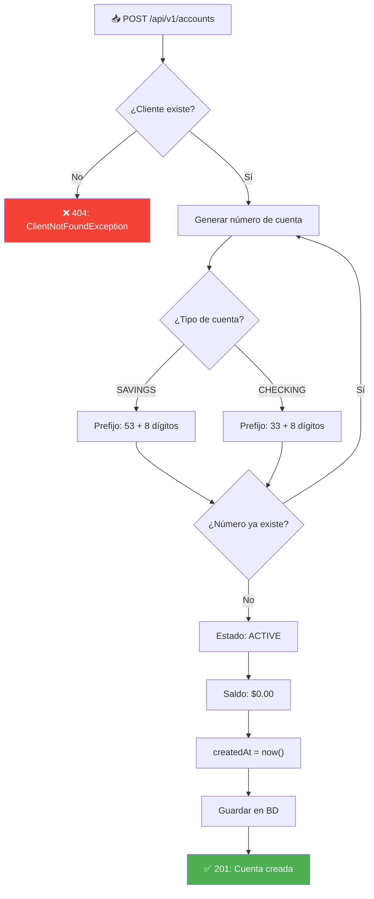
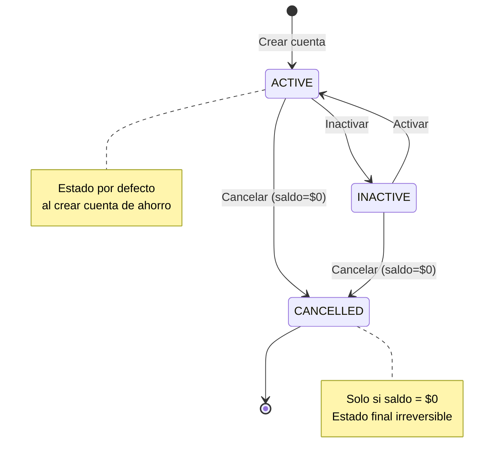

# 🏦 Módulo de Productos (Cuentas) — Backend

## 1. Descripción Funcional

El módulo de productos permite la **gestión de cuentas financieras** (cuentas corrientes y cuentas de ahorros) vinculadas a los clientes de la entidad financiera. Cada cuenta tiene un número único generado automáticamente y soporta diferentes estados.

---

## 2. Reglas de Negocio

| # | Regla | Tipo | Validación |
|---|-------|------|------------|
| RN-P01 | Solo se permiten dos tipos: Cuenta Corriente y Cuenta de Ahorros | Obligatoria | Enum `AccountType` |
| RN-P02 | Un producto solo puede existir si está vinculado a un cliente | Obligatoria | FK `client_id` NOT NULL |
| RN-P03 | La cuenta de ahorros NO puede tener saldo menor a $0 | Obligatoria | Validación en `debit()` |
| RN-P04 | Las cuentas se pueden activar/inactivar en cualquier momento | Obligatoria | Cambio de estado |
| RN-P05 | El número de cuenta es único, 10 dígitos, generado automáticamente | Obligatoria | Factory + UNIQUE constraint |
| RN-P06 | Cuentas de ahorro inician con "53", corrientes con "33" | Obligatoria | `AccountNumberFactory` |
| RN-P07 | Al crear una cuenta de ahorro, se establece como ACTIVA por defecto | Obligatoria | Estado por defecto |
| RN-P08 | Solo se pueden cancelar cuentas con saldo = $0 | Obligatoria | Validación en `cancel()` |
| RN-P09 | La fecha de creación se calcula automáticamente | Obligatoria | `createdAt = now()` |
| RN-P10 | El saldo se actualiza con cada transacción exitosa | Obligatoria | Operaciones `credit()`/`debit()` |

---

## 3. Modelo de Dominio

### Entidad `Account`

```java
package com.trinity.prueba.domain.model;

import com.trinity.prueba.domain.model.enums.AccountStatus;
import com.trinity.prueba.domain.model.enums.AccountType;
import com.trinity.prueba.domain.model.exception.InsufficientBalanceException;
import com.trinity.prueba.domain.model.exception.InvalidAccountStateException;

import java.math.BigDecimal;
import java.time.LocalDateTime;

public class Account {

    private Long id;
    private AccountType accountType;        // SAVINGS, CHECKING
    private String accountNumber;           // 10 dígitos, auto-generado
    private AccountStatus status;           // ACTIVE, INACTIVE, CANCELLED
    private BigDecimal balance;
    private boolean gmfExempt;              // Exenta de GMF
    private LocalDateTime createdAt;
    private LocalDateTime updatedAt;
    private Long clientId;                  // Cliente propietario

    // ==========================================
    // REGLAS DE NEGOCIO (Domain Logic)
    // ==========================================

    /**
     * RN-P10: Acredita (suma) un monto a la cuenta.
     */
    public void credit(BigDecimal amount) {
        if (amount.compareTo(BigDecimal.ZERO) <= 0) {
            throw new IllegalArgumentException("El monto debe ser mayor a $0");
        }
        this.balance = this.balance.add(amount);
        this.updatedAt = LocalDateTime.now();
    }

    /**
     * RN-P03 + RN-P10: Debita (resta) un monto de la cuenta.
     * Cuentas de ahorro no pueden quedar con saldo negativo.
     */
    public void debit(BigDecimal amount) {
        if (amount.compareTo(BigDecimal.ZERO) <= 0) {
            throw new IllegalArgumentException("El monto debe ser mayor a $0");
        }
        BigDecimal newBalance = this.balance.subtract(amount);
        if (this.accountType == AccountType.SAVINGS
                && newBalance.compareTo(BigDecimal.ZERO) < 0) {
            throw new InsufficientBalanceException(
                "La cuenta de ahorros no puede tener saldo menor a $0. " +
                "Saldo actual: $" + this.balance + ", monto a debitar: $" + amount);
        }
        this.balance = newBalance;
        this.updatedAt = LocalDateTime.now();
    }

    /**
     * RN-P04: Activa la cuenta.
     */
    public void activate() {
        if (this.status == AccountStatus.CANCELLED) {
            throw new InvalidAccountStateException(
                "No se puede activar una cuenta cancelada");
        }
        this.status = AccountStatus.ACTIVE;
        this.updatedAt = LocalDateTime.now();
    }

    /**
     * RN-P04: Inactiva la cuenta.
     */
    public void inactivate() {
        if (this.status == AccountStatus.CANCELLED) {
            throw new InvalidAccountStateException(
                "No se puede inactivar una cuenta cancelada");
        }
        this.status = AccountStatus.INACTIVE;
        this.updatedAt = LocalDateTime.now();
    }

    /**
     * RN-P08: Cancela la cuenta. Solo si saldo = $0.
     */
    public void cancel() {
        if (this.balance.compareTo(BigDecimal.ZERO) != 0) {
            throw new InvalidAccountStateException(
                "Solo se pueden cancelar cuentas con saldo igual a $0. " +
                "Saldo actual: $" + this.balance);
        }
        this.status = AccountStatus.CANCELLED;
        this.updatedAt = LocalDateTime.now();
    }

    // Getters, setters, constructores...
}
```

### Enumeraciones

```java
// Tipo de cuenta
public enum AccountType {
    SAVINGS("Cuenta de Ahorros"),
    CHECKING("Cuenta Corriente");

    private final String description;
    AccountType(String description) { this.description = description; }
    public String getDescription() { return description; }
}

// Estado de cuenta
public enum AccountStatus {
    ACTIVE("Activa"),
    INACTIVE("Inactiva"),
    CANCELLED("Cancelada");

    private final String description;
    AccountStatus(String description) { this.description = description; }
    public String getDescription() { return description; }
}
```

### Fábrica de Números de Cuenta

```java
package com.trinity.prueba.domain.model;

import com.trinity.prueba.domain.model.enums.AccountType;
import java.util.Random;

/**
 * RN-P05 + RN-P06: Genera números de cuenta únicos de 10 dígitos.
 * - Cuentas de ahorro: prefijo "53"
 * - Cuentas corrientes: prefijo "33"
 */
public class AccountNumberFactory {

    private static final String SAVINGS_PREFIX = "53";
    private static final String CHECKING_PREFIX = "33";
    private static final int REMAINING_DIGITS = 8;
    private static final Random RANDOM = new Random();

    public static String generate(AccountType type) {
        String prefix = switch (type) {
            case SAVINGS -> SAVINGS_PREFIX;
            case CHECKING -> CHECKING_PREFIX;
        };

        String randomDigits = String.format("%0" + REMAINING_DIGITS + "d",
                RANDOM.nextInt((int) Math.pow(10, REMAINING_DIGITS)));

        return prefix + randomDigits; // Ej: "5312345678" o "3398765432"
    }
}
```

---

## 4. Puertos (Interfaces)

### Puerto de Entrada: `AccountServicePort`

```java
package com.trinity.prueba.domain.port.in;

import com.trinity.prueba.domain.model.Account;
import com.trinity.prueba.domain.model.enums.AccountStatus;
import java.util.List;
import java.util.Optional;

public interface AccountServicePort {

    Account createAccount(Account account);

    Account updateAccountStatus(Long id, AccountStatus status);

    void cancelAccount(Long id);

    Optional<Account> getAccountById(Long id);

    List<Account> getAccountsByClientId(Long clientId);

    List<Account> getAllAccounts();
}
```

### Puerto de Salida: `AccountRepositoryPort`

```java
package com.trinity.prueba.domain.port.out;

import com.trinity.prueba.domain.model.Account;
import java.util.List;
import java.util.Optional;

public interface AccountRepositoryPort {
    Account save(Account account);
    Optional<Account> findById(Long id);
    Optional<Account> findByAccountNumber(String accountNumber);
    List<Account> findByClientId(Long clientId);
    List<Account> findAll();
    boolean existsByClientId(Long clientId);
    boolean existsByAccountNumber(String accountNumber);
}
```

---

## 5. Caso de Uso: `AccountService`

```java
package com.trinity.prueba.application.service;

import com.trinity.prueba.domain.model.Account;
import com.trinity.prueba.domain.model.AccountNumberFactory;
import com.trinity.prueba.domain.model.enums.AccountStatus;
import com.trinity.prueba.domain.model.enums.AccountType;
import com.trinity.prueba.domain.model.exception.*;
import com.trinity.prueba.domain.port.in.AccountServicePort;
import com.trinity.prueba.domain.port.out.AccountRepositoryPort;
import com.trinity.prueba.domain.port.out.ClientRepositoryPort;
import org.springframework.transaction.annotation.Transactional;

import java.math.BigDecimal;
import java.time.LocalDateTime;
import java.util.List;
import java.util.Optional;

@Transactional(readOnly = true)
public class AccountService implements AccountServicePort {

    private final AccountRepositoryPort accountRepository;
    private final ClientRepositoryPort clientRepository;

    public AccountService(AccountRepositoryPort accountRepository,
                          ClientRepositoryPort clientRepository) {
        this.accountRepository = accountRepository;
        this.clientRepository = clientRepository;
    }

    @Override
    @Transactional
    public Account createAccount(Account account) {
        // RN-P02: Verificar que el cliente existe
        clientRepository.findById(account.getClientId())
            .orElseThrow(() -> new ClientNotFoundException(
                "Cliente no encontrado con ID: " + account.getClientId()));

        // RN-P05 + RN-P06: Generar número de cuenta único
        String accountNumber;
        do {
            accountNumber = AccountNumberFactory.generate(account.getAccountType());
        } while (accountRepository.existsByAccountNumber(accountNumber));
        account.setAccountNumber(accountNumber);

        // RN-P07: Cuenta de ahorro activa por defecto
        if (account.getAccountType() == AccountType.SAVINGS) {
            account.setStatus(AccountStatus.ACTIVE);
        } else {
            account.setStatus(AccountStatus.ACTIVE); // Corrientes también activas
        }

        // Saldo inicial en $0 si no se especifica
        if (account.getBalance() == null) {
            account.setBalance(BigDecimal.ZERO);
        }

        // RN-P09: Fecha de creación automática
        account.setCreatedAt(LocalDateTime.now());
        account.setUpdatedAt(LocalDateTime.now());

        return accountRepository.save(account);
    }

    @Override
    @Transactional
    public Account updateAccountStatus(Long id, AccountStatus newStatus) {
        Account account = accountRepository.findById(id)
            .orElseThrow(() -> new AccountNotFoundException(
                "Cuenta no encontrada con ID: " + id));

        // RN-P04: Aplicar cambio de estado
        switch (newStatus) {
            case ACTIVE -> account.activate();
            case INACTIVE -> account.inactivate();
            case CANCELLED -> account.cancel();   // RN-P08: valida saldo = $0
        }

        return accountRepository.save(account);
    }

    @Override
    @Transactional
    public void cancelAccount(Long id) {
        updateAccountStatus(id, AccountStatus.CANCELLED);
    }

    @Override
    public Optional<Account> getAccountById(Long id) {
        return accountRepository.findById(id);
    }

    @Override
    public List<Account> getAccountsByClientId(Long clientId) {
        return accountRepository.findByClientId(clientId);
    }

    @Override
    public List<Account> getAllAccounts() {
        return accountRepository.findAll();
    }
}
```

---

## 6. API REST

### Endpoints

| Método | Endpoint | Descripción | Status Code |
|--------|----------|-------------|-------------|
| `POST` | `/api/v1/accounts` | Crear cuenta | `201 Created` |
| `GET` | `/api/v1/accounts` | Listar todas las cuentas | `200 OK` |
| `GET` | `/api/v1/accounts/{id}` | Obtener cuenta por ID | `200 OK` / `404` |
| `GET` | `/api/v1/accounts/client/{clientId}` | Cuentas por cliente | `200 OK` |
| `PATCH` | `/api/v1/accounts/{id}/status` | Cambiar estado | `200 OK` |
| `DELETE` | `/api/v1/accounts/{id}` | Cancelar cuenta | `200 OK` |

### Request/Response

#### `POST /api/v1/accounts` — Crear Cuenta

**Request Body:**
```json
{
    "accountType": "SAVINGS",
    "clientId": 1,
    "gmfExempt": false
}
```

**Response (201 Created):**
```json
{
    "id": 1,
    "accountType": "SAVINGS",
    "accountNumber": "5312345678",
    "status": "ACTIVE",
    "balance": 0.00,
    "gmfExempt": false,
    "createdAt": "2026-08-14T17:00:00",
    "updatedAt": "2026-08-14T17:00:00",
    "clientId": 1
}
```

#### `PATCH /api/v1/accounts/{id}/status` — Cambiar Estado

**Request Body:**
```json
{
    "status": "INACTIVE"
}
```

**Response (200 OK):**
```json
{
    "id": 1,
    "accountType": "SAVINGS",
    "accountNumber": "5312345678",
    "status": "INACTIVE",
    "balance": 500.00,
    "gmfExempt": false,
    "createdAt": "2026-08-14T17:00:00",
    "updatedAt": "2026-08-14T18:30:00",
    "clientId": 1
}
```

### Respuestas de Error

```json
// 400 - Intentar cancelar cuenta con saldo > $0
{
    "status": 400,
    "error": "Bad Request",
    "message": "Solo se pueden cancelar cuentas con saldo igual a $0. Saldo actual: $500.00",
    "timestamp": "2026-08-14T17:00:00"
}

// 400 - Saldo negativo en cuenta de ahorros
{
    "status": 400,
    "error": "Bad Request",
    "message": "La cuenta de ahorros no puede tener saldo menor a $0",
    "timestamp": "2026-08-14T17:00:00"
}

// 404 - Cliente no encontrado al crear cuenta
{
    "status": 404,
    "error": "Not Found",
    "message": "Cliente no encontrado con ID: 99",
    "timestamp": "2026-08-14T17:00:00"
}
```

---

## 7. Entidad JPA

```java
@Entity
@Table(name = "accounts")
public class AccountEntity {

    @Id
    @GeneratedValue(strategy = GenerationType.IDENTITY)
    private Long id;

    @Enumerated(EnumType.STRING)
    @Column(name = "account_type", nullable = false, length = 10)
    private AccountType accountType;

    @Column(name = "account_number", nullable = false, unique = true, length = 10)
    private String accountNumber;

    @Enumerated(EnumType.STRING)
    @Column(nullable = false, length = 10)
    private AccountStatus status;

    @Column(nullable = false, precision = 15, scale = 2)
    private BigDecimal balance;

    @Column(name = "gmf_exempt", nullable = false)
    private boolean gmfExempt;

    @Column(name = "created_at", nullable = false, updatable = false)
    private LocalDateTime createdAt;

    @Column(name = "updated_at", nullable = false)
    private LocalDateTime updatedAt;

    @Column(name = "client_id", nullable = false)
    private Long clientId;

    @Version
    private Long version;  // Bloqueo optimista para concurrencia

    // Getters y Setters...
}
```

---

## 8. Diagrama de Flujo: Creación de Cuenta



### Diagrama de Estados de Cuenta


