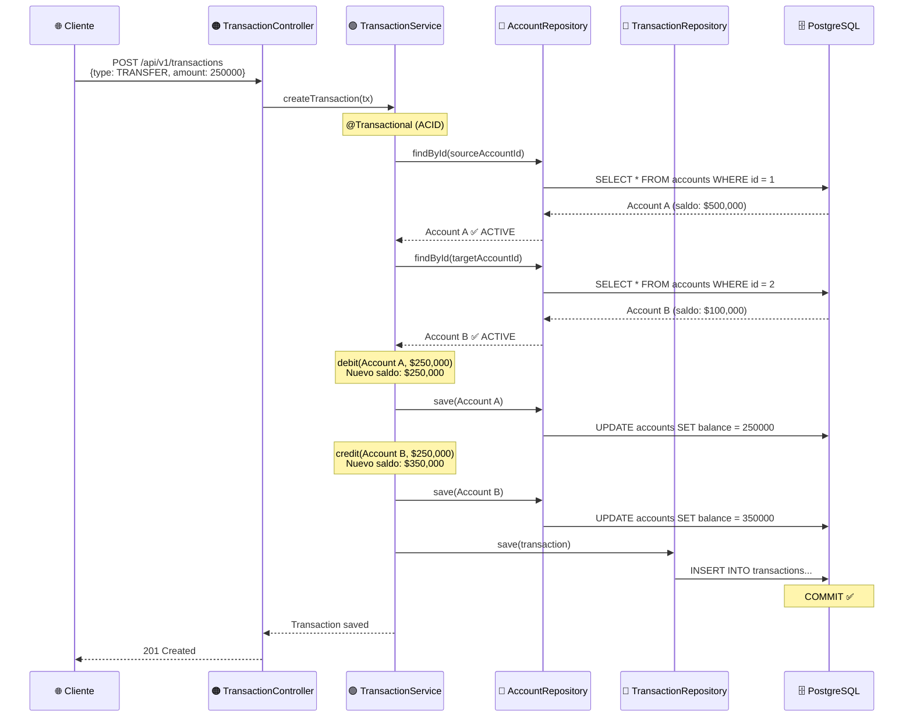
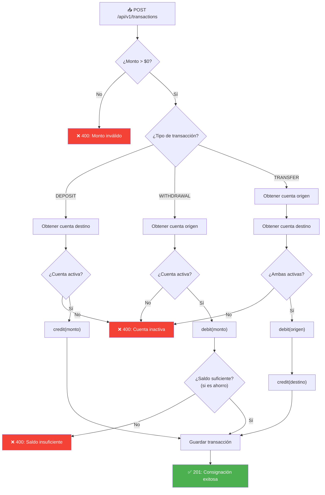

# 💸 Módulo de Transacciones — Backend

## 1. Descripción Funcional

El módulo de transacciones permite realizar **movimientos financieros** sobre las cuentas de los clientes: **consignaciones** (depósitos), **retiros** y **transferencias** entre cuentas. Cada transacción actualiza automáticamente el saldo de las cuentas involucradas.

---

## 2. Reglas de Negocio

| # | Regla | Tipo | Validación |
|---|-------|------|------------|
| RN-T01 | Solo se permiten: Consignación, Retiro y Transferencia | Obligatoria | Enum `TransactionType` |
| RN-T02 | El saldo se actualiza con cada transacción exitosa | Obligatoria | `credit()` / `debit()` |
| RN-T03 | Transferencias solo entre cuentas existentes | Obligatoria | Validar ambas cuentas |
| RN-T04 | Transferencia genera crédito en destino y débito en origen | Obligatoria | Dos movimientos |
| RN-T05 | Cuenta de ahorros NO puede quedar con saldo negativo | Obligatoria | Validación en `debit()` |
| RN-T06 | Solo cuentas activas pueden realizar transacciones | Obligatoria | Verificar `status = ACTIVE` |

---

## 3. Modelo de Dominio

### Entidad `Transaction`

```java
package com.trinity.prueba.domain.model;

import com.trinity.prueba.domain.model.enums.TransactionType;

import java.math.BigDecimal;
import java.time.LocalDateTime;

public class Transaction {

    private Long id;
    private TransactionType transactionType;  // DEPOSIT, WITHDRAWAL, TRANSFER
    private BigDecimal amount;
    private String description;
    private Long sourceAccountId;             // Cuenta origen (para retiros y transferencias)
    private Long targetAccountId;             // Cuenta destino (para consignaciones y transferencias)
    private LocalDateTime createdAt;

    // ==========================================
    // REGLAS DE NEGOCIO
    // ==========================================

    /**
     * Valida que el monto de la transacción sea positivo.
     */
    public boolean hasValidAmount() {
        return this.amount != null && this.amount.compareTo(BigDecimal.ZERO) > 0;
    }

    /**
     * RN-T01: Valida que el tipo de transacción tenga las cuentas requeridas.
     */
    public boolean hasRequiredAccounts() {
        return switch (this.transactionType) {
            case DEPOSIT -> this.targetAccountId != null;
            case WITHDRAWAL -> this.sourceAccountId != null;
            case TRANSFER -> this.sourceAccountId != null && this.targetAccountId != null;
        };
    }

    // Constructores, getters, setters...
}
```

### Enumeración `TransactionType`

```java
package com.trinity.prueba.domain.model.enums;

public enum TransactionType {
    DEPOSIT("Consignación"),
    WITHDRAWAL("Retiro"),
    TRANSFER("Transferencia");

    private final String description;

    TransactionType(String description) {
        this.description = description;
    }

    public String getDescription() {
        return description;
    }
}
```

---

## 4. Puertos (Interfaces)

### Puerto de Entrada: `TransactionServicePort`

```java
package com.trinity.prueba.domain.port.in;

import com.trinity.prueba.domain.model.Transaction;
import java.util.List;

public interface TransactionServicePort {

    /**
     * Crea y ejecuta una transacción financiera.
     * Tipos soportados: DEPOSIT, WITHDRAWAL, TRANSFER.
     */
    Transaction createTransaction(Transaction transaction);

    /**
     * Obtiene todas las transacciones de una cuenta.
     */
    List<Transaction> getTransactionsByAccountId(Long accountId);

    /**
     * Obtiene el estado de cuenta (historial de transacciones).
     */
    List<Transaction> getAccountStatement(Long accountId);
}
```

### Puerto de Salida: `TransactionRepositoryPort`

```java
package com.trinity.prueba.domain.port.out;

import com.trinity.prueba.domain.model.Transaction;
import java.util.List;
import java.util.Optional;

public interface TransactionRepositoryPort {
    Transaction save(Transaction transaction);
    Optional<Transaction> findById(Long id);
    List<Transaction> findBySourceAccountId(Long accountId);
    List<Transaction> findByTargetAccountId(Long accountId);
    List<Transaction> findByAccountId(Long accountId);
}
```

---

## 5. Caso de Uso: `TransactionService`

```java
package com.trinity.prueba.application.service;

import com.trinity.prueba.domain.model.Account;
import com.trinity.prueba.domain.model.Transaction;
import com.trinity.prueba.domain.model.enums.TransactionType;
import com.trinity.prueba.domain.model.exception.*;
import com.trinity.prueba.domain.port.in.TransactionServicePort;
import com.trinity.prueba.domain.port.out.AccountRepositoryPort;
import com.trinity.prueba.domain.port.out.TransactionRepositoryPort;
import org.springframework.transaction.annotation.Transactional;

import java.time.LocalDateTime;
import java.util.List;

@Transactional(readOnly = true)
public class TransactionService implements TransactionServicePort {

    private final TransactionRepositoryPort transactionRepository;
    private final AccountRepositoryPort accountRepository;

    public TransactionService(TransactionRepositoryPort transactionRepository,
                               AccountRepositoryPort accountRepository) {
        this.transactionRepository = transactionRepository;
        this.accountRepository = accountRepository;
    }

    @Override
    @Transactional
    public Transaction createTransaction(Transaction transaction) {
        // Validar monto
        if (!transaction.hasValidAmount()) {
            throw new InvalidTransactionException("El monto debe ser mayor a $0");
        }

        // Validar cuentas requeridas según tipo
        if (!transaction.hasRequiredAccounts()) {
            throw new InvalidTransactionException(
                "La transacción no tiene las cuentas requeridas para el tipo: "
                + transaction.getTransactionType());
        }

        // Ejecutar según tipo de transacción
        return switch (transaction.getTransactionType()) {
            case DEPOSIT -> executeDeposit(transaction);
            case WITHDRAWAL -> executeWithdrawal(transaction);
            case TRANSFER -> executeTransfer(transaction);
        };
    }

    // =============================================
    // CONSIGNACIÓN (Depósito)
    // =============================================
    private Transaction executeDeposit(Transaction transaction) {
        // Obtener cuenta destino
        Account targetAccount = getActiveAccount(transaction.getTargetAccountId());

        // RN-T02: Acreditar monto
        targetAccount.credit(transaction.getAmount());
        accountRepository.save(targetAccount);

        // Registrar transacción
        transaction.setCreatedAt(LocalDateTime.now());
        return transactionRepository.save(transaction);
    }

    // =============================================
    // RETIRO
    // =============================================
    private Transaction executeWithdrawal(Transaction transaction) {
        // Obtener cuenta origen
        Account sourceAccount = getActiveAccount(transaction.getSourceAccountId());

        // RN-T02 + RN-T05: Debitar monto (valida saldo en cuentas de ahorro)
        sourceAccount.debit(transaction.getAmount());
        accountRepository.save(sourceAccount);

        // Registrar transacción
        transaction.setCreatedAt(LocalDateTime.now());
        return transactionRepository.save(transaction);
    }

    // =============================================
    // TRANSFERENCIA
    // =============================================
    private Transaction executeTransfer(Transaction transaction) {
        // RN-T03: Verificar que ambas cuentas existen y están activas
        Account sourceAccount = getActiveAccount(transaction.getSourceAccountId());
        Account targetAccount = getActiveAccount(transaction.getTargetAccountId());

        // Validar que no sea la misma cuenta
        if (sourceAccount.getId().equals(targetAccount.getId())) {
            throw new InvalidTransactionException(
                "No se puede transferir a la misma cuenta");
        }

        // RN-T04: Débito en cuenta origen
        sourceAccount.debit(transaction.getAmount());
        accountRepository.save(sourceAccount);

        // RN-T04: Crédito en cuenta destino
        targetAccount.credit(transaction.getAmount());
        accountRepository.save(targetAccount);

        // Registrar la transacción principal
        transaction.setCreatedAt(LocalDateTime.now());
        Transaction savedTransaction = transactionRepository.save(transaction);

        return savedTransaction;
    }

    // =============================================
    // UTILIDADES
    // =============================================

    /**
     * RN-T06: Obtiene una cuenta activa o lanza excepción.
     */
    private Account getActiveAccount(Long accountId) {
        Account account = accountRepository.findById(accountId)
            .orElseThrow(() -> new AccountNotFoundException(
                "Cuenta no encontrada con ID: " + accountId));

        if (account.getStatus() != com.trinity.prueba.domain.model.enums.AccountStatus.ACTIVE) {
            throw new InvalidAccountStateException(
                "La cuenta " + account.getAccountNumber() + " no está activa. " +
                "Estado actual: " + account.getStatus());
        }

        return account;
    }

    @Override
    public List<Transaction> getTransactionsByAccountId(Long accountId) {
        return transactionRepository.findByAccountId(accountId);
    }

    @Override
    public List<Transaction> getAccountStatement(Long accountId) {
        // Verificar que la cuenta existe
        accountRepository.findById(accountId)
            .orElseThrow(() -> new AccountNotFoundException(
                "Cuenta no encontrada con ID: " + accountId));

        return transactionRepository.findByAccountId(accountId);
    }
}
```

---

## 6. API REST

### Endpoints

| Método | Endpoint | Descripción | Status Code |
|--------|----------|-------------|-------------|
| `POST` | `/api/v1/transactions` | Crear transacción | `201 Created` |
| `GET` | `/api/v1/transactions/account/{accountId}` | Transacciones por cuenta | `200 OK` |
| `GET` | `/api/v1/transactions/account/{accountId}/statement` | Estado de cuenta | `200 OK` |

### Controller

```java
@RestController
@RequestMapping("/api/v1/transactions")
@CrossOrigin(origins = "http://localhost:4200")
public class TransactionController {

    private final TransactionServicePort transactionService;

    public TransactionController(TransactionServicePort transactionService) {
        this.transactionService = transactionService;
    }

    @PostMapping
    public ResponseEntity<Transaction> create(@RequestBody Transaction transaction) {
        return ResponseEntity.status(HttpStatus.CREATED)
                .body(transactionService.createTransaction(transaction));
    }

    @GetMapping("/account/{accountId}")
    public ResponseEntity<List<Transaction>> getByAccount(@PathVariable Long accountId) {
        return ResponseEntity.ok(transactionService.getTransactionsByAccountId(accountId));
    }

    @GetMapping("/account/{accountId}/statement")
    public ResponseEntity<List<Transaction>> getStatement(@PathVariable Long accountId) {
        return ResponseEntity.ok(transactionService.getAccountStatement(accountId));
    }
}
```

### Request/Response

#### `POST /api/v1/transactions` — Consignación

**Request:**
```json
{
    "transactionType": "DEPOSIT",
    "amount": 500000.00,
    "description": "Consignación en efectivo",
    "targetAccountId": 1
}
```

**Response (201):**
```json
{
    "id": 1,
    "transactionType": "DEPOSIT",
    "amount": 500000.00,
    "description": "Consignación en efectivo",
    "sourceAccountId": null,
    "targetAccountId": 1,
    "createdAt": "2026-08-14T17:00:00"
}
```

#### `POST /api/v1/transactions` — Retiro

**Request:**
```json
{
    "transactionType": "WITHDRAWAL",
    "amount": 100000.00,
    "description": "Retiro en cajero",
    "sourceAccountId": 1
}
```

#### `POST /api/v1/transactions` — Transferencia

**Request:**
```json
{
    "transactionType": "TRANSFER",
    "amount": 250000.00,
    "description": "Transferencia a terceros",
    "sourceAccountId": 1,
    "targetAccountId": 2
}
```

**Response (201):**
```json
{
    "id": 3,
    "transactionType": "TRANSFER",
    "amount": 250000.00,
    "description": "Transferencia a terceros",
    "sourceAccountId": 1,
    "targetAccountId": 2,
    "createdAt": "2026-08-14T17:15:00"
}
```

#### `GET /api/v1/transactions/account/1/statement` — Estado de Cuenta

**Response (200):**
```json
[
    {
        "id": 1,
        "transactionType": "DEPOSIT",
        "amount": 500000.00,
        "description": "Consignación en efectivo",
        "targetAccountId": 1,
        "createdAt": "2026-08-14T17:00:00"
    },
    {
        "id": 2,
        "transactionType": "WITHDRAWAL",
        "amount": 100000.00,
        "description": "Retiro en cajero",
        "sourceAccountId": 1,
        "createdAt": "2026-08-14T17:05:00"
    },
    {
        "id": 3,
        "transactionType": "TRANSFER",
        "amount": 250000.00,
        "description": "Transferencia a terceros",
        "sourceAccountId": 1,
        "targetAccountId": 2,
        "createdAt": "2026-08-14T17:15:00"
    }
]
```

### Respuestas de Error

```json
// 400 - Saldo insuficiente
{
    "status": 400,
    "error": "Bad Request",
    "message": "La cuenta de ahorros no puede tener saldo menor a $0. Saldo actual: $150000.00, monto a debitar: $250000.00",
    "timestamp": "2026-08-14T17:00:00"
}

// 400 - Cuenta inactiva
{
    "status": 400,
    "error": "Bad Request",
    "message": "La cuenta 5312345678 no está activa. Estado actual: INACTIVE",
    "timestamp": "2026-08-14T17:00:00"
}

// 404 - Cuenta no encontrada
{
    "status": 404,
    "error": "Not Found",
    "message": "Cuenta no encontrada con ID: 99",
    "timestamp": "2026-08-14T17:00:00"
}
```

---

## 7. Entidad JPA

```java
@Entity
@Table(name = "transactions")
public class TransactionEntity {

    @Id
    @GeneratedValue(strategy = GenerationType.IDENTITY)
    private Long id;

    @Enumerated(EnumType.STRING)
    @Column(name = "transaction_type", nullable = false, length = 15)
    private TransactionType transactionType;

    @Column(nullable = false, precision = 15, scale = 2)
    private BigDecimal amount;

    @Column(length = 255)
    private String description;

    @Column(name = "source_account_id")
    private Long sourceAccountId;

    @Column(name = "target_account_id")
    private Long targetAccountId;

    @Column(name = "created_at", nullable = false, updatable = false)
    private LocalDateTime createdAt;

    // Getters y Setters...
}
```

---

## 8. Diagramas

### Flujo de una Transferencia



### Diagrama de Flujo General


