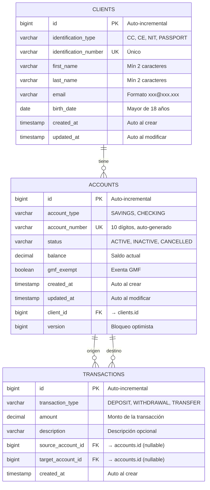

# 🗄️ DDL — Definición de Datos (Data Definition Language)

## 1. Descripción

Los scripts **DDL** definen la **estructura** de la base de datos: tablas, columnas, tipos de datos, índices, restricciones y relaciones. Estos scripts se ejecutan para crear el esquema de la base de datos del sistema financiero.

---

## 2. Diagrama Entidad-Relación (ER)



---

## 3. Script de Creación de Base de Datos

```sql
-- =============================================
-- CREAR BASE DE DATOS
-- =============================================
CREATE DATABASE entidad_financiera
    WITH OWNER = postgres
    ENCODING = 'UTF8'
    LC_COLLATE = 'en_US.UTF-8'
    LC_CTYPE = 'en_US.UTF-8'
    TEMPLATE = template0;

-- Conectar a la base de datos
\c entidad_financiera;

-- Crear esquema
CREATE SCHEMA IF NOT EXISTS financial;
SET search_path TO financial, public;
```

---

## 4. Script de Creación de Tablas

### Tabla `clients`

```sql
-- =============================================
-- TABLA: CLIENTES
-- =============================================
CREATE TABLE IF NOT EXISTS clients (
    id                    BIGSERIAL       PRIMARY KEY,
    identification_type   VARCHAR(20)     NOT NULL,
    identification_number VARCHAR(20)     NOT NULL,
    first_name            VARCHAR(100)    NOT NULL,
    last_name             VARCHAR(100)    NOT NULL,
    email                 VARCHAR(150)    NOT NULL,
    birth_date            DATE            NOT NULL,
    created_at            TIMESTAMP       NOT NULL DEFAULT CURRENT_TIMESTAMP,
    updated_at            TIMESTAMP       NOT NULL DEFAULT CURRENT_TIMESTAMP,

    -- Constraints
    CONSTRAINT uq_client_identification UNIQUE (identification_number),
    CONSTRAINT chk_client_identification_type
        CHECK (identification_type IN ('CC', 'CE', 'PASSPORT')),
    CONSTRAINT chk_client_first_name_length
        CHECK (LENGTH(first_name) >= 2),
    CONSTRAINT chk_client_last_name_length
        CHECK (LENGTH(last_name) >= 2),
    CONSTRAINT chk_client_email_format
        CHECK (email ~* '^[A-Za-z0-9._%+-]+@[A-Za-z0-9.-]+\.[A-Za-z]{2,}$'),
    CONSTRAINT chk_client_birth_date
        CHECK (birth_date <= CURRENT_DATE - INTERVAL '18 years')
);

-- Índices
CREATE INDEX idx_clients_identification_number
    ON clients (identification_number);

CREATE INDEX idx_clients_email
    ON clients (email);

-- Comentarios
COMMENT ON TABLE clients IS 'Tabla de clientes de la entidad financiera';
COMMENT ON COLUMN clients.identification_type IS 'Tipo de identificación: CC, CE, NIT, PASSPORT';
COMMENT ON COLUMN clients.identification_number IS 'Número de identificación único del cliente';
COMMENT ON COLUMN clients.birth_date IS 'Fecha de nacimiento (debe ser mayor de 18 años)';
COMMENT ON COLUMN clients.created_at IS 'Fecha de registro automática';
COMMENT ON COLUMN clients.updated_at IS 'Fecha de última modificación automática';
```

### Tabla `accounts`

```sql
-- =============================================
-- TABLA: CUENTAS (PRODUCTOS FINANCIEROS)
-- =============================================
CREATE TABLE IF NOT EXISTS accounts (
    id                BIGSERIAL       PRIMARY KEY,
    account_type      VARCHAR(10)     NOT NULL,
    account_number    VARCHAR(10)     NOT NULL,
    status            VARCHAR(10)     NOT NULL DEFAULT 'ACTIVE',
    balance           DECIMAL(15, 2)  NOT NULL DEFAULT 0.00,
    gmf_exempt        BOOLEAN         NOT NULL DEFAULT FALSE,
    created_at        TIMESTAMP       NOT NULL DEFAULT CURRENT_TIMESTAMP,
    updated_at        TIMESTAMP       NOT NULL DEFAULT CURRENT_TIMESTAMP,
    client_id         BIGINT          NOT NULL,
    version           BIGINT          NOT NULL DEFAULT 0,

    -- Foreign Keys
    CONSTRAINT fk_account_client
        FOREIGN KEY (client_id) REFERENCES clients(id)
        ON DELETE RESTRICT
        ON UPDATE CASCADE,

    -- Constraints
    CONSTRAINT uq_account_number UNIQUE (account_number),
    CONSTRAINT chk_account_type
        CHECK (account_type IN ('SAVINGS', 'CHECKING')),
    CONSTRAINT chk_account_status
        CHECK (status IN ('ACTIVE', 'INACTIVE', 'CANCELLED')),
    CONSTRAINT chk_account_number_length
        CHECK (LENGTH(account_number) = 10),
    CONSTRAINT chk_account_number_prefix
        CHECK (
            (account_type = 'SAVINGS' AND account_number LIKE '53%') OR
            (account_type = 'CHECKING' AND account_number LIKE '33%')
        ),
    CONSTRAINT chk_savings_balance
        CHECK (account_type != 'SAVINGS' OR balance >= 0)
);

-- Índices
CREATE INDEX idx_accounts_client_id
    ON accounts (client_id);

CREATE INDEX idx_accounts_account_number
    ON accounts (account_number);

CREATE INDEX idx_accounts_status
    ON accounts (status);

-- Comentarios
COMMENT ON TABLE accounts IS 'Tabla de cuentas bancarias (productos financieros)';
COMMENT ON COLUMN accounts.account_type IS 'Tipo de cuenta: SAVINGS (ahorro) o CHECKING (corriente)';
COMMENT ON COLUMN accounts.account_number IS 'Número de cuenta único de 10 dígitos (53xx=ahorro, 33xx=corriente)';
COMMENT ON COLUMN accounts.status IS 'Estado de la cuenta: ACTIVE, INACTIVE, CANCELLED';
COMMENT ON COLUMN accounts.gmf_exempt IS 'Indica si la cuenta está exenta del Gravamen a Movimientos Financieros';
COMMENT ON COLUMN accounts.version IS 'Versión para control de concurrencia optimista';
```

### Tabla `transactions`

```sql
-- =============================================
-- TABLA: TRANSACCIONES (MOVIMIENTOS FINANCIEROS)
-- =============================================
CREATE TABLE IF NOT EXISTS transactions (
    id                  BIGSERIAL       PRIMARY KEY,
    transaction_type    VARCHAR(15)     NOT NULL,
    amount              DECIMAL(15, 2)  NOT NULL,
    description         VARCHAR(255),
    source_account_id   BIGINT,
    target_account_id   BIGINT,
    created_at          TIMESTAMP       NOT NULL DEFAULT CURRENT_TIMESTAMP,

    -- Foreign Keys
    CONSTRAINT fk_transaction_source_account
        FOREIGN KEY (source_account_id) REFERENCES accounts(id)
        ON DELETE RESTRICT,

    CONSTRAINT fk_transaction_target_account
        FOREIGN KEY (target_account_id) REFERENCES accounts(id)
        ON DELETE RESTRICT,

    -- Constraints
    CONSTRAINT chk_transaction_type
        CHECK (transaction_type IN ('DEPOSIT', 'WITHDRAWAL', 'TRANSFER')),
    CONSTRAINT chk_transaction_amount
        CHECK (amount > 0),
    CONSTRAINT chk_transaction_accounts
        CHECK (
            (transaction_type = 'DEPOSIT' AND target_account_id IS NOT NULL) OR
            (transaction_type = 'WITHDRAWAL' AND source_account_id IS NOT NULL) OR
            (transaction_type = 'TRANSFER' AND source_account_id IS NOT NULL
                AND target_account_id IS NOT NULL)
        )
);

-- Índices
CREATE INDEX idx_transactions_source_account
    ON transactions (source_account_id);

CREATE INDEX idx_transactions_target_account
    ON transactions (target_account_id);

CREATE INDEX idx_transactions_created_at
    ON transactions (created_at);

CREATE INDEX idx_transactions_type
    ON transactions (transaction_type);

-- Comentarios
COMMENT ON TABLE transactions IS 'Tabla de transacciones financieras';
COMMENT ON COLUMN transactions.transaction_type IS 'Tipo: DEPOSIT (consignación), WITHDRAWAL (retiro), TRANSFER (transferencia)';
COMMENT ON COLUMN transactions.source_account_id IS 'Cuenta origen (para retiros y transferencias)';
COMMENT ON COLUMN transactions.target_account_id IS 'Cuenta destino (para consignaciones y transferencias)';
```

---

## 5. Trigger para Actualizar `updated_at`

```sql
-- =============================================
-- FUNCIÓN: Actualizar fecha de modificación
-- =============================================
CREATE OR REPLACE FUNCTION update_updated_at_column()
RETURNS TRIGGER AS $$
BEGIN
    NEW.updated_at = CURRENT_TIMESTAMP;
    RETURN NEW;
END;
$$ LANGUAGE plpgsql;

-- Trigger para clients
CREATE TRIGGER trg_clients_updated_at
    BEFORE UPDATE ON clients
    FOR EACH ROW
    EXECUTE FUNCTION update_updated_at_column();

-- Trigger para accounts
CREATE TRIGGER trg_accounts_updated_at
    BEFORE UPDATE ON accounts
    FOR EACH ROW
    EXECUTE FUNCTION update_updated_at_column();
```

---

## 6. Script Completo de Inicialización

```sql
-- =============================================
-- SCRIPT COMPLETO DE INICIALIZACIÓN (init.sql)
-- Ejecutar en orden al crear la base de datos
-- =============================================

-- 1. Crear tablas
-- (incluir CREATE TABLE de clients, accounts, transactions)

-- 2. Crear función de trigger
-- (incluir CREATE FUNCTION update_updated_at_column)

-- 3. Crear triggers
-- (incluir CREATE TRIGGER)

-- 4. Verificar creación
SELECT table_name, table_type
FROM information_schema.tables
WHERE table_schema = 'public'
ORDER BY table_name;
```

---

## 7. Resumen de Objetos DDL

| Tipo | Nombre | Descripción |
|------|--------|-------------|
| **Tabla** | `clients` | Clientes de la entidad financiera |
| **Tabla** | `accounts` | Cuentas bancarias (productos financieros) |
| **Tabla** | `transactions` | Movimientos financieros |
| **Índice** | `idx_clients_identification_number` | Búsqueda rápida por cédula |
| **Índice** | `idx_accounts_client_id` | Cuentas por cliente |
| **Índice** | `idx_accounts_account_number` | Búsqueda por número de cuenta |
| **Índice** | `idx_transactions_source_account` | Transacciones por cuenta origen |
| **Índice** | `idx_transactions_target_account` | Transacciones por cuenta destino |
| **Índice** | `idx_transactions_created_at` | Ordenamiento por fecha |
| **Constraint** | `uq_client_identification` | Identificación única |
| **Constraint** | `uq_account_number` | Número de cuenta único |
| **Constraint** | `chk_savings_balance` | Saldo ≥ 0 en cuentas de ahorro |
| **Constraint** | `chk_account_number_prefix` | Prefijo 53 o 33 |
| **Constraint** | `chk_transaction_amount` | Monto > 0 |
| **Trigger** | `trg_clients_updated_at` | Auto-actualizar `updated_at` |
| **Trigger** | `trg_accounts_updated_at` | Auto-actualizar `updated_at` |
| **Función** | `update_updated_at_column()` | Función del trigger |
| **FK** | `fk_account_client` | Cuenta → Cliente |
| **FK** | `fk_transaction_source_account` | Transacción → Cuenta origen |
| **FK** | `fk_transaction_target_account` | Transacción → Cuenta destino |
