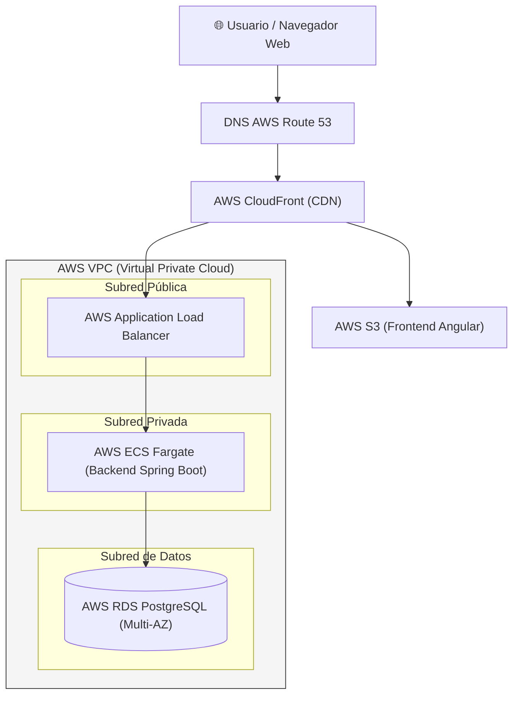

# ☁️ Servicios en la Nube y Arquitectura de Despliegue

## 1. Descripción General

Este documento describe la arquitectura recomendada para el despliegue del sistema financiero en la nube (AWS / GCP / Azure), asegurando alta disponibilidad, escalabilidad y seguridad.

---

## 2. Arquitectura de Despliegue Cloud (AWS)

---

## 3. Servicios Nube Recomendados

| Componente | Servicio AWS | Servicio GCP | Servicio Azure |
|------------|--------------|--------------|----------------|
| **Base de Datos** | AWS RDS PostgreSQL | Cloud SQL for PostgreSQL | Azure Database for PostgreSQL |
| **Backend** | AWS ECS / App Runner | Cloud Run | Azure App Service / Container Apps |
| **Frontend** | AWS S3 + CloudFront | Firebase Hosting / Cloud Storage | Azure Static Web Apps |
| **DNS / SSL** | AWS Route 53 + ACM | Cloud DNS | Azure DNS |
| **Monitoreo** | AWS CloudWatch | Cloud Monitoring | Azure Monitor |
