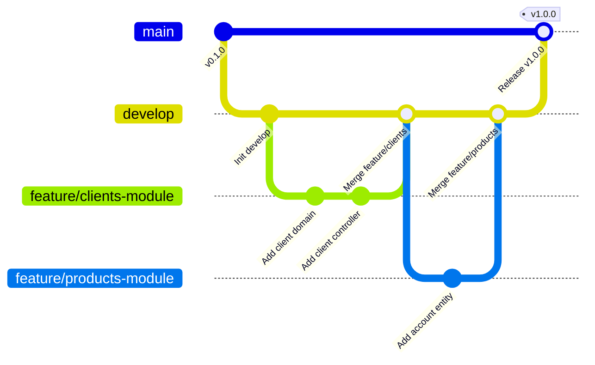

# 🔀 Git Flow y Estrategia de Versionamiento

## 1. Descripción General

Para garantizar el control de cambios, la integración continua y la entrega continua (CI/CD), el equipo de desarrollo utiliza la estrategia de ramificación **Git Flow**.

---

## 2. Estructura de Ramas

| Rama | Propósito | Reglas |
|------|-----------|--------|
| `main` | Código de producción listo para despliegue | Solo recibe merges de `release` o `hotfix`. Etiquetado con versiones semánticas (v1.0.0). |
| `develop` | Rama principal de integración para desarrollo | Recibe merges de ramas `feature`. Base para nuevas características. |
| `feature/*` | Nuevas funcionalidades o módulos | Creada desde `develop`, se fusiona de nuevo a `develop` mediante Pull Request. |
| `hotfix/*` | Correcciones urgentes en producción | Creada desde `main`, se fusiona a `main` y a `develop`. |

---

## 3. Convención de Commits (Conventional Commits)

Formatos de mensaje estandarizados:

- `feat(clients): añadir validación de mayoría de edad`
- `fix(accounts): corregir error 500 en actualización de estado`
- `docs(readme): actualizar índice de documentación`
- `test(transactions): añadir pruebas unitarias de transferencias`
- `refactor(domain): simplificar lógica de fábrica de números de cuenta`
