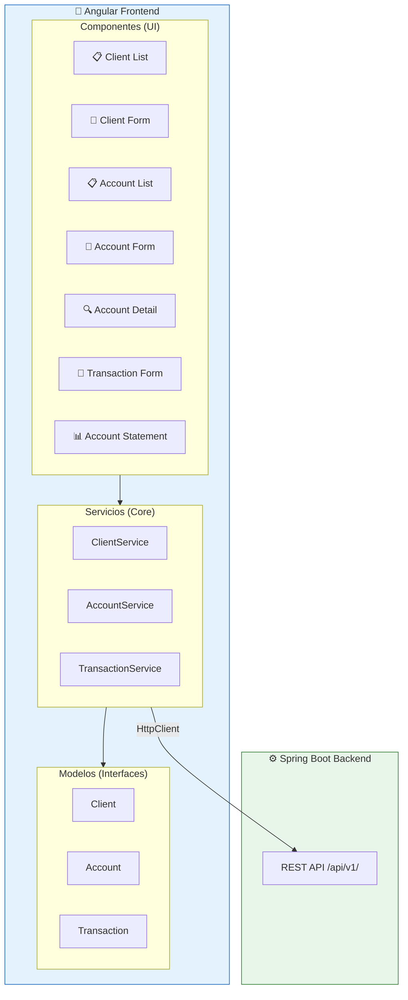

# 🎨 Arquitectura Frontend — Angular

## 1. Descripción General

El frontend de la aplicación está desarrollado con **Angular 18+**, siguiendo una arquitectura modular basada en **componentes standalone**, **servicios inyectables** y **routing lazy-loaded**. Se comunica con el backend Spring Boot a través de la API REST expuesta en `/api/v1/`.

---

## 2. Stack Tecnológico del Frontend

| Tecnología | Propósito | Versión |
|-----------|-----------|---------|
| **Angular** | Framework principal | 18+ |
| **TypeScript** | Lenguaje de programación | 5.x |
| **Angular Router** | Navegación y rutas | 18+ |
| **HttpClient** | Comunicación HTTP con backend | 18+ |
| **Reactive Forms** | Formularios reactivos con validaciones | 18+ |
| **Angular Material / CSS** | Estilos y componentes visuales | — |

---

## 3. Estructura del Proyecto

```
frontend/
├── src/
│   ├── app/
│   │   ├── core/                          # 🔵 Servicios y guards globales
│   │   │   ├── services/                  # Servicios HTTP (API calls)
│   │   │   │   ├── client.service.ts
│   │   │   │   ├── account.service.ts
│   │   │   │   └── transaction.service.ts
│   │   │   ├── models/                    # Interfaces y tipos TypeScript
│   │   │   │   ├── client.model.ts
│   │   │   │   ├── account.model.ts
│   │   │   │   └── transaction.model.ts
│   │   │   └── interceptors/              # HTTP Interceptors
│   │   │       └── error.interceptor.ts
│   │   │
│   │   ├── modules/                       # 🟢 Módulos funcionales
│   │   │   ├── clients/                   # Módulo de Clientes
│   │   │   │   ├── client-list/
│   │   │   │   ├── client-form/
│   │   │   │   └── clients.routes.ts
│   │   │   ├── accounts/                  # Módulo de Productos (Cuentas)
│   │   │   │   ├── account-list/
│   │   │   │   ├── account-form/
│   │   │   │   ├── account-detail/
│   │   │   │   └── accounts.routes.ts
│   │   │   └── transactions/              # Módulo de Transacciones
│   │   │       ├── transaction-form/
│   │   │       ├── account-statement/
│   │   │       └── transactions.routes.ts
│   │   │
│   │   ├── shared/                        # 🟠 Componentes compartidos
│   │   │   ├── components/
│   │   │   │   ├── navbar/
│   │   │   │   ├── confirm-dialog/
│   │   │   │   └── alert-message/
│   │   │   └── pipes/
│   │   │       └── currency-format.pipe.ts
│   │   │
│   │   ├── app.component.ts               # Componente raíz
│   │   ├── app.config.ts                  # Configuración standalone
│   │   └── app.routes.ts                  # Rutas principales
│   │
│   ├── assets/                            # Recursos estáticos
│   ├── environments/                      # Variables de entorno
│   │   ├── environment.ts
│   │   └── environment.prod.ts
│   ├── styles.css                         # Estilos globales
│   └── index.html                         # HTML principal
│
├── angular.json                           # Configuración Angular CLI
├── tsconfig.json                          # Configuración TypeScript
└── package.json                           # Dependencias npm
```

---

## 4. Diagrama de Arquitectura



---

## 5. Configuración de Rutas

```typescript
// app.routes.ts
export const routes: Routes = [
    { path: '', redirectTo: 'clients', pathMatch: 'full' },
    {
        path: 'clients',
        loadChildren: () => import('./modules/clients/clients.routes')
            .then(m => m.CLIENTS_ROUTES)
    },
    {
        path: 'accounts',
        loadChildren: () => import('./modules/accounts/accounts.routes')
            .then(m => m.ACCOUNTS_ROUTES)
    },
    {
        path: 'transactions',
        loadChildren: () => import('./modules/transactions/transactions.routes')
            .then(m => m.TRANSACTIONS_ROUTES)
    },
    { path: '**', redirectTo: 'clients' }
];
```

---

## 6. Variables de Entorno

```typescript
// environment.ts (desarrollo)
export const environment = {
    production: false,
    apiUrl: 'http://localhost:8080/api/v1'
};

// environment.prod.ts (producción)
export const environment = {
    production: true,
    apiUrl: '/api/v1'
};
```

---

## 7. Comunicación con el Backend

### Tabla de Endpoints Consumidos

| Servicio Angular | Método HTTP | Endpoint Backend | Descripción |
|----------------|-------------|-----------------|-------------|
| `ClientService` | `POST` | `/api/v1/clients` | Crear cliente |
| `ClientService` | `GET` | `/api/v1/clients` | Listar clientes |
| `ClientService` | `GET` | `/api/v1/clients/{id}` | Obtener cliente |
| `ClientService` | `PUT` | `/api/v1/clients/{id}` | Actualizar cliente |
| `ClientService` | `DELETE` | `/api/v1/clients/{id}` | Eliminar cliente |
| `AccountService` | `POST` | `/api/v1/accounts` | Crear cuenta |
| `AccountService` | `GET` | `/api/v1/accounts` | Listar cuentas |
| `AccountService` | `GET` | `/api/v1/accounts/{id}` | Obtener cuenta |
| `AccountService` | `GET` | `/api/v1/accounts/client/{clientId}` | Cuentas por cliente |
| `AccountService` | `PUT` | `/api/v1/accounts/{id}/status` | Cambiar estado |
| `AccountService` | `DELETE` | `/api/v1/accounts/{id}` | Cancelar cuenta |
| `TransactionService` | `POST` | `/api/v1/transactions` | Crear transacción |
| `TransactionService` | `GET` | `/api/v1/transactions/account/{id}` | Transacciones por cuenta |
| `TransactionService` | `GET` | `/api/v1/transactions/account/{id}/statement` | Estado de cuenta |

---

## 8. Manejo de Errores (HTTP Interceptor)

```typescript
// error.interceptor.ts
export const errorInterceptor: HttpInterceptorFn = (req, next) => {
    return next(req).pipe(
        catchError((error: HttpErrorResponse) => {
            let errorMessage = 'Ha ocurrido un error inesperado';

            if (error.error?.message) {
                errorMessage = error.error.message;
            }

            // Mostrar notificación al usuario
            console.error('Error HTTP:', error.status, errorMessage);

            return throwError(() => ({
                status: error.status,
                message: errorMessage,
                timestamp: error.error?.timestamp
            }));
        })
    );
};
```

---

## 9. Principios Aplicados

| Principio | Aplicación en el Frontend |
|-----------|--------------------------|
| **Modularidad** | Cada funcionalidad en su propio módulo (clients, accounts, transactions) |
| **Separación de responsabilidades** | Componentes (UI), Servicios (lógica HTTP), Modelos (tipado) |
| **Lazy Loading** | Módulos cargados bajo demanda para optimizar rendimiento |
| **Reactive Programming** | Uso de Observables (RxJS) para flujos de datos asíncronos |
| **Type Safety** | Interfaces TypeScript para todos los modelos de datos |
| **Standalone Components** | Componentes independientes sin necesidad de NgModules |
