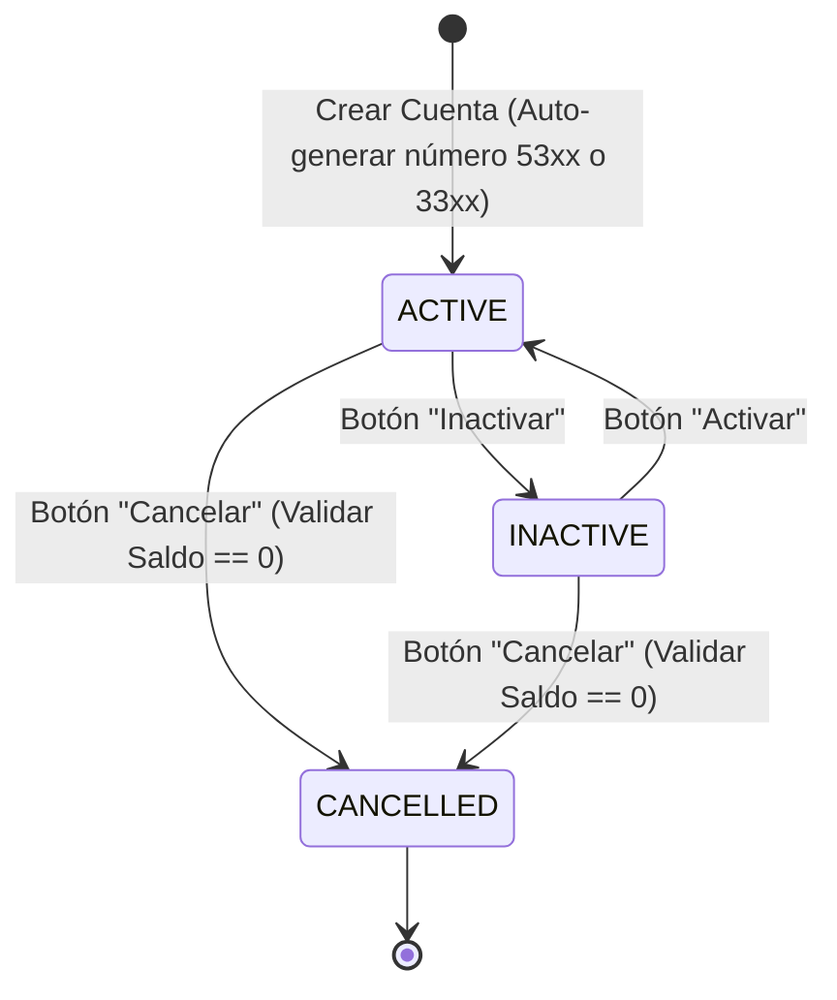

# 🏦 Módulo de Productos/Cuentas (UI) — Frontend Angular

## 1. Descripción Funcional

El módulo de productos (cuentas bancarias) permite a los usuarios gestionar cuentas de ahorros y corrientes vinculadas a un cliente: **creación de cuenta**, **cambio de estado** (Activa, Inactiva, Cancelada) y **consulta de productos** por cliente.

---

## 2. Componentes e Interfaz de Usuario

### 2.1 Listado de Cuentas (`AccountListComponent`)

**Ruta:** `/accounts` o `/accounts/client/:clientId`

Muestra las cuentas vinculadas a un cliente o la totalidad de cuentas financieras.

```typescript
@Component({
  selector: 'app-account-list',
  standalone: true,
  imports: [CommonModule, RouterModule, CurrencyPipe],
  templateUrl: './account-list.component.html'
})
export class AccountListComponent implements OnInit {
  accounts: Account[] = [];
  selectedClientId?: number;

  constructor(
    private accountService: AccountService,
    private route: ActivatedRoute
  ) {}

  ngOnInit(): void {
    this.route.params.subscribe(params => {
      if (params['clientId']) {
        this.selectedClientId = +params['clientId'];
        this.loadAccountsByClient(this.selectedClientId);
      } else {
        this.loadAllAccounts();
      }
    });
  }

  loadAccountsByClient(clientId: number): void {
    this.accountService.getAccountsByClientId(clientId).subscribe({
      next: (data) => this.accounts = data,
      error: (err) => console.error(err)
    });
  }

  loadAllAccounts(): void {
    this.accountService.getAllAccounts().subscribe({
      next: (data) => this.accounts = data,
      error: (err) => console.error(err)
    });
  }

  changeStatus(accountId: number, newStatus: 'ACTIVE' | 'INACTIVE' | 'CANCELLED'): void {
    this.accountService.updateAccountStatus(accountId, newStatus).subscribe({
      next: () => this.reload(),
      error: (err) => alert(err.message) // RN-P08: Error si saldo > $0 al cancelar
    });
  }

  reload(): void {
    if (this.selectedClientId) {
      this.loadAccountsByClient(this.selectedClientId);
    } else {
      this.loadAllAccounts();
    }
  }
}
```

---

### 2.2 Formulario de Creación de Cuenta (`AccountFormComponent`)

**Ruta:** `/accounts/new`

```typescript
@Component({
  selector: 'app-account-form',
  standalone: true,
  imports: [CommonModule, ReactiveFormsModule, RouterModule],
  templateUrl: './account-form.component.html'
})
export class AccountFormComponent implements OnInit {
  accountForm!: FormGroup;
  clients: Client[] = [];

  accountTypes = [
    { code: 'SAVINGS', label: 'Cuenta de Ahorros' },
    { code: 'CHECKING', label: 'Cuenta Corriente' }
  ];

  constructor(
    private fb: FormBuilder,
    private accountService: AccountService,
    private clientService: ClientService,
    private router: Router
  ) {}

  ngOnInit(): void {
    this.initForm();
    this.loadClients();
  }

  initForm(): void {
    this.accountForm = this.fb.group({
      clientId: ['', Validators.required],
      accountType: ['SAVINGS', Validators.required],
      gmfExempt: [false]
    });
  }

  loadClients(): void {
    this.clientService.getAllClients().subscribe(data => this.clients = data);
  }

  createAccount(): void {
    if (this.accountForm.invalid) return;

    this.accountService.createAccount(this.accountForm.value).subscribe({
      next: (created) => {
        alert(`Cuenta creada exitosamente con número: ${created.accountNumber}`);
        this.router.navigate(['/accounts']);
      },
      error: (err) => alert(err.message)
    });
  }
}
```

---

## 3. Servicio AccountService (`account.service.ts`)

```typescript
@Injectable({
  providedIn: 'root'
})
export class AccountService {
  private apiUrl = `${environment.apiUrl}/accounts`;

  constructor(private http: HttpClient) {}

  getAllAccounts(): Observable<Account[]> {
    return this.http.get<Account[]>(this.apiUrl);
  }

  getAccountById(id: number): Observable<Account> {
    return this.http.get<Account>(`${this.apiUrl}/${id}`);
  }

  getAccountsByClientId(clientId: number): Observable<Account[]> {
    return this.http.get<Account[]>(`${this.apiUrl}/client/${clientId}`);
  }

  createAccount(request: CreateAccountRequest): Observable<Account> {
    return this.http.post<Account>(this.apiUrl, request);
  }

  updateAccountStatus(id: number, status: 'ACTIVE' | 'INACTIVE' | 'CANCELLED'): Observable<Account> {
    return this.http.put<Account>(`${this.apiUrl}/${id}/status`, { status });
  }

  cancelAccount(id: number): Observable<void> {
    return this.http.delete<void>(`${this.apiUrl}/${id}`);
  }
}
```

---

## 4. Máquina de Estados de Cuentas en la UI


