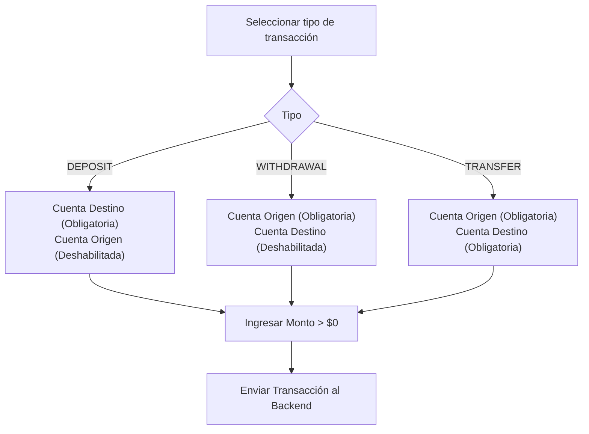

# 💸 Módulo de Transacciones (UI) — Frontend Angular

## 1. Descripción Funcional

El módulo de transacciones en la interfaz de usuario permite ejecutar movimientos financieros (**consignaciones**, **retiros** y **transferencias**) sobre las cuentas bancarias activas, así como consultar el **historial de transacciones** y el **estado de cuenta**.

---

## 2. Componentes e Interfaz de Usuario

### 2.1 Formulario de Transacciones (`TransactionFormComponent`)

**Ruta:** `/transactions/new`

Formulario dinámico que muestra u oculta campos según el tipo de transacción seleccionado.

```typescript
@Component({
  selector: 'app-transaction-form',
  standalone: true,
  imports: [CommonModule, ReactiveFormsModule, RouterModule],
  templateUrl: './transaction-form.component.html'
})
export class TransactionFormComponent implements OnInit {
  transactionForm!: FormGroup;
  accounts: Account[] = [];

  transactionTypes = [
    { code: 'DEPOSIT', label: 'Consignación' },
    { code: 'WITHDRAWAL', label: 'Retiro' },
    { code: 'TRANSFER', label: 'Transferencia' }
  ];

  constructor(
    private fb: FormBuilder,
    private transactionService: TransactionService,
    private accountService: AccountService,
    private router: Router
  ) {}

  ngOnInit(): void {
    this.initForm();
    this.loadAccounts();

    // Actualizar validadores según el tipo de transacción seleccionada
    this.transactionForm.get('transactionType')?.valueChanges.subscribe(type => {
      this.updateAccountValidators(type);
    });
  }

  initForm(): void {
    this.transactionForm = this.fb.group({
      transactionType: ['DEPOSIT', Validators.required],
      amount: ['', [Validators.required, Validators.min(0.01)]],
      description: [''],
      sourceAccountId: [null],
      targetAccountId: [null]
    });
  }

  updateAccountValidators(type: string): void {
    const sourceCtrl = this.transactionForm.get('sourceAccountId');
    const targetCtrl = this.transactionForm.get('targetAccountId');

    sourceCtrl?.clearValidators();
    targetCtrl?.clearValidators();

    if (type === 'WITHDRAWAL' || type === 'TRANSFER') {
      sourceCtrl?.setValidators([Validators.required]);
    }
    if (type === 'DEPOSIT' || type === 'TRANSFER') {
      targetCtrl?.setValidators([Validators.required]);
    }

    sourceCtrl?.updateValueAndValidity();
    targetCtrl?.updateValueAndValidity();
  }

  loadAccounts(): void {
    this.accountService.getAllAccounts().subscribe(data => {
      // RN-T06: Solo mostrar cuentas activas en la interfaz
      this.accounts = data.filter(a => a.status === 'ACTIVE');
    });
  }

  executeTransaction(): void {
    if (this.transactionForm.invalid) return;

    this.transactionService.createTransaction(this.transactionForm.value).subscribe({
      next: (res) => {
        alert('Transacción ejecutada con éxito');
        this.router.navigate(['/transactions/account', res.targetAccountId || res.sourceAccountId]);
      },
      error: (err) => alert(err.message) // RN-T05 / RN-T06: Error por saldo o estado
    });
  }
}
```

---

### 2.2 Estado de Cuenta (`AccountStatementComponent`)

**Ruta:** `/transactions/account/:accountId/statement`

Muestra el extracto/historial detallado de las transacciones efectuadas sobre una cuenta determinada.

```typescript
@Component({
  selector: 'app-account-statement',
  standalone: true,
  imports: [CommonModule, RouterModule, CurrencyPipe, DatePipe],
  templateUrl: './account-statement.component.html'
})
export class AccountStatementComponent implements OnInit {
  accountId!: number;
  account?: Account;
  transactions: Transaction[] = [];

  constructor(
    private route: ActivatedRoute,
    private transactionService: TransactionService,
    private accountService: AccountService
  ) {}

  ngOnInit(): void {
    this.route.params.subscribe(params => {
      this.accountId = +params['accountId'];
      this.loadData();
    });
  }

  loadData(): void {
    this.accountService.getAccountById(this.accountId).subscribe(a => this.account = a);
    this.transactionService.getAccountStatement(this.accountId).subscribe(t => this.transactions = t);
  }
}
```

---

## 3. Servicio TransactionService (`transaction.service.ts`)

```typescript
@Injectable({
  providedIn: 'root'
})
export class TransactionService {
  private apiUrl = `${environment.apiUrl}/transactions`;

  constructor(private http: HttpClient) {}

  createTransaction(request: CreateTransactionRequest): Observable<Transaction> {
    return this.http.post<Transaction>(this.apiUrl, request);
  }

  getTransactionsByAccountId(accountId: number): Observable<Transaction[]> {
    return this.http.get<Transaction[]>(`${this.apiUrl}/account/${accountId}`);
  }

  getAccountStatement(accountId: number): Observable<Transaction[]> {
    return this.http.get<Transaction[]>(`${this.apiUrl}/account/${accountId}/statement`);
  }
}
```

---

## 4. Diagrama de Flujo del Formulario Dinámico


